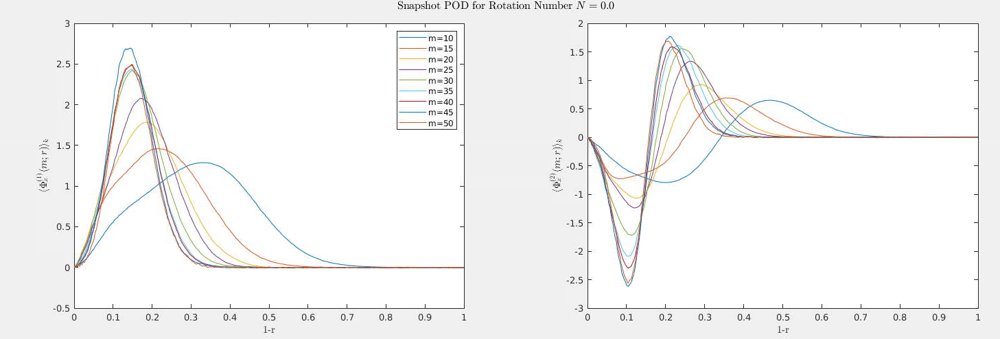
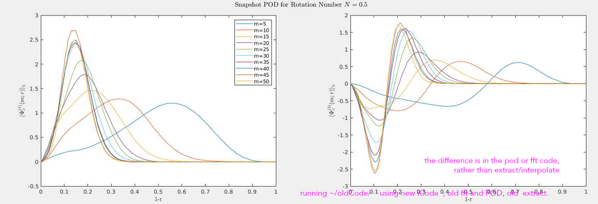
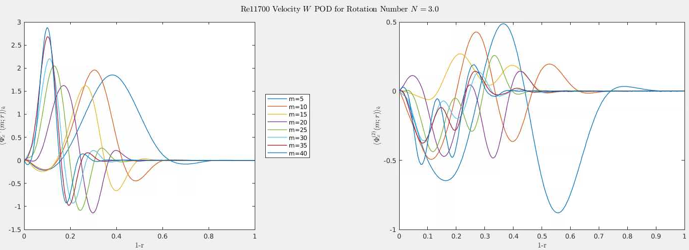

#+TITLE: POD Analysis of Turbulent Pipe Flow
#+AUTHOR: M. Raba
#+LATEX_COMPILER: xelatex
# this is the size i usually use:
#+LATEX_header: ​\geometry{paperwidth=700pt, paperheight=2000pt}

#+HTML_HEAD: <link rel="stylesheet" href="https://cdn.jsdelivr.net/npm/reveal.js/dist/reveal.css"/>
#+REVEAL_HTML_HEAD_EXTRA: 
#+REVEAL_HTML_HEAD_EXTRA: 

#+reveal_theme: serif
#+REVEAL_EXTRA_CSS: style.css

#+HTML_HEAD: 

#+LATEX_HEADER:\setcounter{MaxMatrixCols}{20}
# #+latex_header: \mode<beamer>{\usetheme{league}}
# #+latex_header:\usepackage{xeCJK}
#+latex_header:\usepackage{fontspec}
#+latex_header:\setmonofont{DejaVu Sans Mono}
# #+latex_header:\setmainfont{Avenir LT Std}
# #+latex_header:\setsansfont{Avenir LT Std}
# #+latex_header:\setsansfont{SF UI Text}
# #+latex_header: \setbeamerfont{section}{size=\scriptsize,series=\bfseries,parent=structure}
# #+latex_header: \setbeamerfont{section}{font=EB Garamond}

#+latex_header: \usepackage{setspace}
#+latex_header: \onehalfspacing
#+OPTIONS: toc:nil
# #+OPTIONS: toc:t
#+LATEX_HEADER: \usepackage{booktabs}
#+LATEX_HEADER:  \usepackage[table]{xcolor}
#+LATEX_HEADER: \usepackage{colortbl}
#+LATEX_HEADER:  \usepackage{sectsty}
#+LATEX_HEADER:  \usepackage{soul}
#+LATEX_HEADER: \allsectionsfont{\normalfont\sffamily\bfseries}
#+LATEX_HEADER: \usepackage{microtype}
#+LATEX_HEADER:\usepackage{siunitx}
#+LATEX_HEADER:\usepackage{physics}
# #+LATEX_HEADER:\usepackage{amsmath}
#+LATEX_HEADER:\usepackage[tikz]{bclogo}
# #+latex_header:\usepackage[citestyle=authoryear-icomp,bibstyle=authoryear, hyperref=true,backref=true,maxcitenames=3,url=true,backend=biber,natbib=true]{biblatex}
#+latex_header:\usepackage[style=authoryear-icomp,bibstyle=authoryear, hyperref=true,backref=true,maxcitenames=3,url=true,backend=biber,natbib=true]{biblatex}
# #+latex_header:\addbibresource{bib.bib}
#+latex_header:\bibliography{bib.bib}
# #+latex_header:\addbibresource{bib}
# #+latex_header:\setmainfont[Variant = 1, Ligatures = {Common,Rare}]{Zapfino}%
# #+latex_header: ​\setmathsfont(Digits)[Numbers={Lining, Proportional}]{Fira Sans Light}
# #+latex_header:\usepackage[cache=false]{minted}
#+latex_header:\usepackage{minted,xcolor}
# #+latex_header:\usemintedstyle{monokai}
#+latex_header:\usemintedstyle{manni}
# #+latex_header:\usemintedstyle{perldoc}
# #+latex_header:\definecolor{bg}{HTML}{282828}
# #+latex_header:\definecolor{bg}{HTML}{4d1933} # dark purple color
# #+latex_header:\definecolor{bg}{HTML}{fdffcf} # yellow
#+latex_header:\definecolor{bg}{HTML}{ffffe6}
#+latex_header:\setminted{bgcolor=bg}
#+latex_header:\setminted{linenos}
# #+latex_header:\setminted{fontsize=\large}
# #+latex_header:\setminted{framesep=2mm}
# #+latex_header:\setminted{escapeinsid=e||,mathescape}
#+latex_header:\definecolor{Tiffany}{HTML}{00ffdd}
#+latex_header:\setbeamercolor{alerted text}{fg=Orange}
#+latex_header:\setbeamercolor{frametitle}{bg=tyrianPurple}
#+latex_header: \usepackage{tikz}
#+latex_header: \metroset{block=fill}

* Background and Motivation
#+BEGIN_EXPORT html

  <!-- LEFT column: Context & Relevance -->
  

    

      <i>Background and Motivation</i>
    

    
<b>Talk Title:</b> POD Analysis of Turbulent Pipe Flow

    
<b>Why Rotating Pipe Flow?</b>

    <ul style="margin-left: 1em;">
      <li>Simple geometry, yet rich in turbulent dynamics</li>
      <li>Ideal for studying rotation-induced turbulence suppression</li>
      <li>Relevant to aerospace, combustion, and industrial flows</li>
    </ul>

    
<b>Historical Observations:</b>

    <ul style="margin-left: 1em;">
      <li>Rotation reduces skin friction and pressure loss</li>
      <li>Experiments (e.g., White 1964, Kikuyama et al. 1983) showed relaminarization at high rotation rates</li>
    </ul>
  

  <!-- RIGHT column: Research Gaps & Objectives -->
  

    

      <i>Research Gaps & Objectives</i>
    

    
<b>Challenges:</b>

    <ul style="margin-left: 1em;">
      <li>Limited DNS studies at moderate-to-high Reynolds numbers</li>
      <li>RANS/LES models struggle to capture suppression mechanisms</li>
    </ul>

    
<b>Goals of This Work:</b>

    <ul style="margin-left: 1em;">
      <li>Use DNS to quantify turbulence suppression</li>
      <li>Apply POD to identify dominant coherent structures</li>
      <li>Provide benchmark data for turbulence model validation</li>
    </ul>

    

      <i>This study bridges the gap between high-fidelity simulations and reduced-order modeling of rotating turbulent flows.</i>
    

  

#+END_EXPORT

* DNS Turbulent Model
#+BEGIN_EXPORT html

  <!-- LEFT column: Simulation Context -->
  

    

      <i>DNS Configuration: Rotating Turbulent Pipe Flow</i>
    

    
<b>Flow Type:</b> Axially rotating turbulent pipe flow

    
<b>Solver:</b> Nek5000 (Spectral Element Method)

    
<b>Reynolds Numbers:</b> 5,300 and 11,700

    
<b>Rotation Numbers (N):</b> 0 to 3

    
<b>Domain:</b> Streamwise extent of 15D, periodic boundaries

    
<b>Purpose:</b> Study turbulence suppression and provide DNS benchmark data

  

  <!-- RIGHT column: Numerical & Grid Setup -->
  

    

      <i>Numerical & Grid Details</i>
    

    
<b>Time Integration:</b>

    <ul style="margin-left: 1em;">
      <li>Viscous terms: BDF3 (implicit)</li>
      <li>Nonlinear terms: Explicit extrapolation (3rd order)</li>
    </ul>

    
<b>Grid Resolution (wall units y⁺):</b>

    <ul style="margin-left: 1em;">
      <li>Radial: 0.14–4.4 (Re = 5300), 0.16–4.7 (Re = 11,700)</li>
      <li>Azimuthal: 1.5–5.0</li>
      <li>Streamwise: 3.0–9.9</li>
    </ul>

    
<b>Mesh:</b> Hexahedral elements with high-order tensor polynomials

    
<b>Parallelization:</b> MPI with auto-tuned algorithms

    
<b>Pressure Solver:</b> Algebraic Multigrid (AMG)

    
<b>Temporal Averaging:</b> Over 6.5 flow-throughs (after transient)

  

#+END_EXPORT

* POD Energy Modes
#+BEGIN_EXPORT html

  <!-- LEFT column: Direct POD Formulation -->
  

    

      <i>Direct POD Formulation</i>
    

    
<b>(2.1)</b> Radial eigenvalue problem:

    $$ \int S(k, m; r, r') \, \Phi_n(k, m; r') \, r' \, dr' = \lambda_n(k, m) \, \Phi_n(k, m; r) $$

    
<b>(2.2)</b> Cross-correlation tensor:

    $$ S(k, m; r, r') = \lim_{\tau \to \infty} \frac{1}{\tau} \int_0^\tau \mathbf{u}(k, m; r, t) \, \mathbf{u}^*(k, m; r', t) \, dt $$

    
<b>(2.3)</b> POD coefficient projection:

    $$ \alpha_n(k, m; t) = \int \mathbf{u}(k, m; r, t) \, \Phi_n^*(k, m; r) \, r \, dr $$
  

  <!-- RIGHT column: Snapshot POD & Conditional Mode -->
  

    

      <i>Snapshot POD & Conditional Mode</i>
    

    
<b>(2.4)</b> Time-domain eigenvalue problem:

    $$ \int R(k, m; t, t') \, \alpha_n(k, m; t') \, dt' = \lambda_n(k, m) \, \alpha_n(k, m; t) $$

    
<b>(2.5)</b> Mode reconstruction:

    $$ \int \mathbf{u}^T(k, m; r, t) \, \alpha_n^*(k, m; t) \, dt = \Phi_n^T(k, m; r) \, \lambda_n(k, m) $$

    
<b>(2.6)</b> Conditional mode definition:

    $$ \Psi_n(m; \xi, r) = \lim_{\chi \to \infty} \frac{1}{\chi} \int_0^\chi \int_0^\tau \mathbf{u}^T(m; r, x+\xi, t) \, \alpha_n(m; x, t) \, dt \, dx $$
  

#+END_EXPORT

* FFT / POD Interpretation
#+BEGIN_EXPORT html

  <!-- LEFT column: FFT Decomposition -->
  

    

      <i>FFT Decomposition in Pipe Flow</i>
    

    
<b>Azimuthal FFT:</b>

    <ul style="margin-left: 1em;">
      <li>Exploits rotational symmetry of the pipe</li>
      <li>Azimuthal mode number <i>m</i> defines spanwise length scale</li>
      <li>Highlights circumferential structure and periodicity</li>
    </ul>

    
<b>Streamwise FFT:</b>

    <ul style="margin-left: 1em;">
      <li>Captures axial periodicity and wavelength</li>
      <li>Mode number <i>k</i> relates to streamwise extent of structures</li>
      <li>Useful for identifying repeating patterns like VLSMs</li>
    </ul>

    
<b>Why FFT?</b>

    <ul style="margin-left: 1em;">
      <li>Geometry-driven decomposition</li>
      <li>Modes are known a priori due to symmetry</li>
      <li>Accelerates POD convergence</li>
    </ul>
  

  <!-- RIGHT column: POD Characteristics -->
  

    

      <i>Proper Orthogonal Decomposition (POD)</i>
    

    
<b>Nature of POD Modes:</b>

    <ul style="margin-left: 1em;">
      <li>Data-driven: extracted from simulation or experiment</li>
      <li>Ranked by energy content (most energetic first)</li>
      <li>Capture coherent structures across scales</li>
    </ul>

    
<b>Snapshot POD:</b>

    <ul style="margin-left: 1em;">
      <li>Assumes separability of space and time</li>
      <li>Reduces computational cost by working in time domain</li>
      <li>Enables modal analysis of large datasets</li>
    </ul>

    
<b>Complementarity:</b>

    <ul style="margin-left: 1em;">
      <li>FFT modes reflect geometry</li>
      <li>POD modes reflect physics and energy distribution</li>
      <li>Combined FFT-POD approach enhances interpretability</li>
    </ul>
  

#+END_EXPORT

* POD Mode Behavior at N = 0
#+BEGIN_EXPORT html

  <!-- LEFT column: POD Interpretation for N = 0 -->
  

    

      <i>POD Mode Behavior at N = 0</i>
    

    <ul style="margin-left: 1em;">
      <li><b>Rotation Number:</b> N = 0 (non-rotating pipe)</li>
      <li><b>Flow Regime:</b> Classical turbulent pipe flow</li>
      <li><b>Azimuthal Modes:</b> m = 2 to 36</li>
      <li><b>Radial Profiles:</b> Symmetric, peak away from wall</li>
      <li><b>Conditional Modes:</b> Show coherent structures aligned with streamwise direction</li>
      <li><b>Interpretation:</b> Near-wall turbulence is strong; structures are well-developed and span the pipe radius</li>
    </ul>

    

      <i>This baseline case helps contrast the effects of rotation on POD mode shape and energy distribution.</i>
    

  

  <!-- RIGHT column: Image Display -->
  

    
  

#+END_EXPORT

** POD Mode Behavior at N = 1
#+BEGIN_EXPORT html

  <!-- LEFT column: POD Interpretation for N = 1 -->
  

    

      <i>POD Mode Behavior at N = 1</i>
    

    <ul style="margin-left: 1em;">
      <li><b>Rotation Number:</b> N = 1 (moderate rotation)</li>
      <li><b>Swirl Number:</b> Ratio of azimuthal to axial momentum flux; quantifies rotational intensity</li>
      <li><b>Flow Regime:</b> Transitional toward relaminarization</li>
      <li><b>Azimuthal Modes:</b> m = 2 to 36</li>
      <li><b>Radial Profiles:</b> Begin to shift inward; near-wall peaks flatten</li>
      <li><b>Azimuthal Structure:</b> Enhanced swirl due to Coriolis effects</li>
      <li><b>Interpretation:</b> Rotation suppresses near-wall turbulence and redistributes energy toward the core</li>
    </ul>

    

      <i>Compared to N = 0, the POD modes at N = 1 show early signs of turbulence suppression and structural reorganization.</i>
    

  

  <!-- RIGHT column: Image Display -->
  

    
  

#+END_EXPORT

** N=3

#+BEGIN_EXPORT html

  <!-- LEFT column: POD Interpretation for N = 3 -->
    

        

              <i>POD Mode Behavior at N = 3</i>
                  

                      <ul style="margin-left: 1em;">
                            <li><b>Rotation Number:</b> N = 3 (strong rotation)</li>
                                  <li><b>Swirl Number:</b> High azimuthal momentum; dominant rotational effects</li>
                                        <li><b>Flow Regime:</b> Strong turbulence suppression; approaching relaminarization</li>
                                              <li><b>Azimuthal Modes:</b> Energy concentrated in low modes (m = 5–20)</li>
                                                    <li><b>Radial Profiles:</b> Streamwise structures shift closer to wall; radial structures broaden</li>
                                                          <li><b>Azimuthal Structure:</b> Reduced wall-normal extent; secondary peaks emerge</li>
                                                                <li><b>Interpretation:</b> Rotation reorganizes turbulence, suppresses near-wall activity, and enhances core coherence</li>
                                                                    </ul>

                                                                        

                                                                              <i>At N = 3, POD modes show strong coherence and redistribution of energy, with dominant structures moving toward the wall and secondary peaks forming near the centerline.</i>
                                                                                  

                                                                                    

                                                                                      <!-- RIGHT column: Image Display -->
                                                                                        

                                                                                            
                                                                                              

                                                                                              

#+END_EXPORT

* FFT-POD Mode Shapes

#+BEGIN_EXPORT html

  <!-- Title -->
  

    POD Mode 1 at Re = 11,700 for Azimuthal Modes m = 5 and m = 10
  

  <!-- Image Row -->
  

    <!-- Left Image: m = 5 -->
    

      
      

        <i>Azimuthal Mode m = 5 (N = 3)</i> 
        Coherent structure with 5-lobed symmetry; strong modal energy concentration.
      

    

    <!-- Right Image: m = 10 -->
    

      
      

        <i>Azimuthal Mode m = 10 (N = 1)</i> 
        Finer-scale oscillatory structure; reduced energy per mode compared to m = 5.
      

    

  

#+END_EXPORT

* Radial POD Modes

#+caption: $N=0.0$ Radial POD Azimuthal Modes

** $N=0.5$
#+caption: $N=0.5$ Radial POD Azimuthal Modes

#+caption: Ref (Hellstrom 2017 Benchmark)
[[../origPODtalks/images/reveal/screenshot2023-01-06_11-48-02_.png]]

** $N=3$

#+caption: $N=3$ Radial POD Azimuthal Modes

