#+TITLE: Seiga [清雅] Three Generations of Pure Elegance
#+SUBTITLE: The Work of Living National Treasure Kenji Suda [須田賢司]
#+AUTHOR: Michael Raba for AS 390
#+OPTIONS: num:nil toc:nil title:nil

#+REVEAL_TITLE_SLIDE: <h1 style="font-size: 2.2em;">%t</h1><h3 style="color: #555;">%s</h3>
Presented by: %a

# #+TITLE: Inherited Elegance
# #+SUBTITLE: Three Generations of Suda Mastery
# #+AUTHOR: Presented by: Michael Raba for AS 390
#+OPTIONS: num:nil toc:nil
#+OPTIONS: toc:nil num:nil creator:nil timestamp:nil

# --- Reveal.js Configuration ---
#+REVEAL_ROOT: https://cdn.jsdelivr.net/npm/reveal.js@4.6.0/
#+REVEAL_THEME: serif
#+REVEAL_TRANS: fade
#+REVEAL_INIT_OPTIONS: controls:true, progress:true, slideNumber:true, transition:'fade'
#+REVEAL_EXTRA_CSS: style.css

* Kenji Suda: The Living National Treasure (Japan)
  :PROPERTIES:
  :CUSTOM_ID: introduction
  :END:
#+BEGIN_EXPORT html
<li style="margin-bottom: 12px;"><strong>Born:</strong> June 27, 1954 | Tokyo, Japan</li>
<li style="margin-bottom: 12px;"><strong>Heritage:</strong> A <em>Ningen Kokuho</em> (Living National Treasure) representing the fourth generation of the Suda woodworking lineage.</li>

 

    
  

  

    <ul style="list-style-type: none; padding-left: 0;">
      <li style="margin-bottom: 10px;"><strong>Apprenticeship:</strong> Trained in the rigorous "Standard" of <em>Sashimono</em> joinery under his father, <strong>Suda Sousui (1910-1979)</strong>.</li>
      <li style="margin-bottom: 10px;"><strong>Shrine Carpentry:</strong> Studied the structural principles of <em>Miya-daiku</em> (shrine carpentry) through the legacy of his grandfather, <strong>Suda Kiichi (1877-1950)</strong>.</li>
      <li style="margin-bottom: 10px;"><strong>Urushi Artistry:</strong> Refined his lacquer techniques by studying with his maternal grandfather, incorporating traditional <em>Urushi</em> finishes into his woodwork.</li>
    </ul>
  

#+END_EXPORT

** Detail

#+CAPTION: Suda Sashimono Lineage (Four Generations)
| Generation | Name (Birth/Art) | Kanji    | Lifespan   | English Meaning / Role                  |
|------------+------------------+----------+------------+-----------------------------------------|
| 1st        | Suda Kiichi      | 須田 喜一 | Late Meiji | Founder of the Tokyo Lineage            |
| 2nd        | Suda Sōgetsu     | 須田 桑月 | 1877–1950  | "Mulberry Moon" (Master of Kuwa)        |
| 3rd        | Suda Sōsui       | 須田 桑翠 | 1910–1979  | "Mulberry Kingfisher" (Kenji's Teacher) |
| 4th        | Suda Kenji       | 須田 賢司 | 1954–Pres. | "Wise Admin" (Living National Treasure) |

** Kenji in workshop

#+ATTR_HTML: :style max-height: 50vh; width: auto; object-fit: contain;
[[./images/kenji2.png]]

* Style/Technique

- use of local kiln dried woods (mulberry)
- unites: blacksmithing, joinery, and lacquer (fuku-urshi)

#+begin_export html

  

    <h3 style="color: #666;">blind (hidden) joinery</h3>
    
  

  

    <h3 style="color: #666;">lacquered detail closeup</h3>
    
  

#+end_export

* Hand joinery

[[./images/dove1.gif]]

Chisel work for precise fit

* Suda Sogetsu (1877-1950)

#+ATTR_HTML: :style max-height: 50vh; width: auto; object-fit: contain;
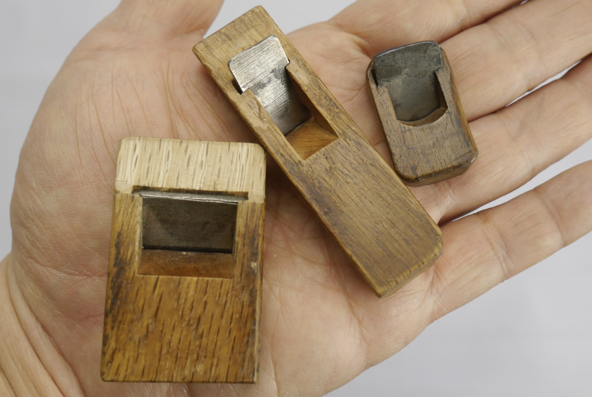

The small planes in the hand of Kenji

** Detail

#+ATTR_HTML: :style max-height: 20vh; width: auto; object-fit: contain;

The small planes in the hand of Kenji

Blades are said to be the
works of famous bladesmith Nobuyoshi. Kenji wrote that, “There is nothing more
to say except that they cut well.” The well-used tools have a particular
beauty.

* Grandfather's Box
Mulberry writing box
Creator: Suda Sogetsu (1877-1950)

#+ATTR_HTML: :style max-height: 50vh; width: auto; object-fit: contain;
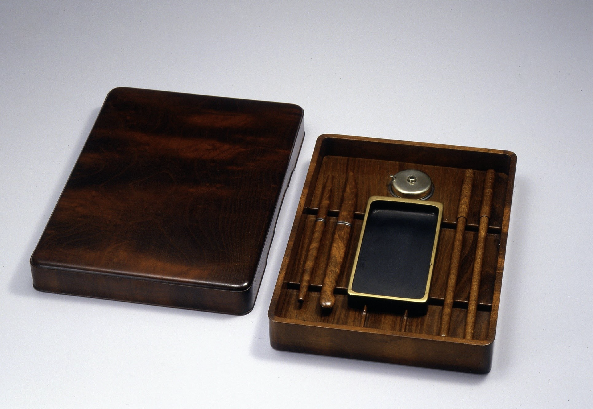

** Detail

#+ATTR_HTML: :style max-height: 20vh; width: auto; object-fit: contain;

credited with elevating the family's technical standards to the elite levels required for Imperial-grade furnishings.

- *Imperial Household Agency* : functional, ultra-high-end furnishings meant for the environments where the Imperial family lived or held audiences.

* Father's Box
Suda Kuwasui "Black Persimmon Chest of Drawers" 1979

#+ATTR_HTML: :style max-height: 50vh; width: auto; object-fit: contain;
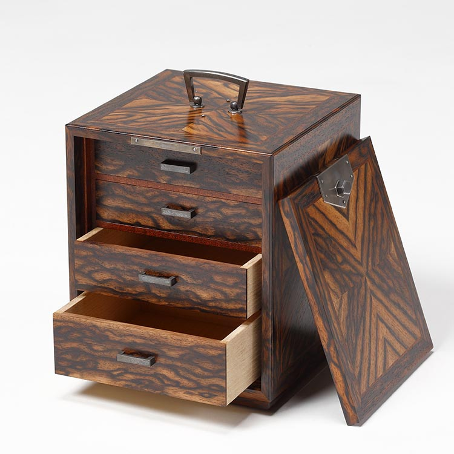
** Detail

#+ATTR_HTML: :style max-height: 20vh; width: auto; object-fit: contain;

- clean lines, structural balance, and the functional beauty of the Sashimono joints.

- National Art Exhibitions

* Historical First

#+ATTR_HTML: :style max-height: 50vh; width: auto; object-fit: contain;
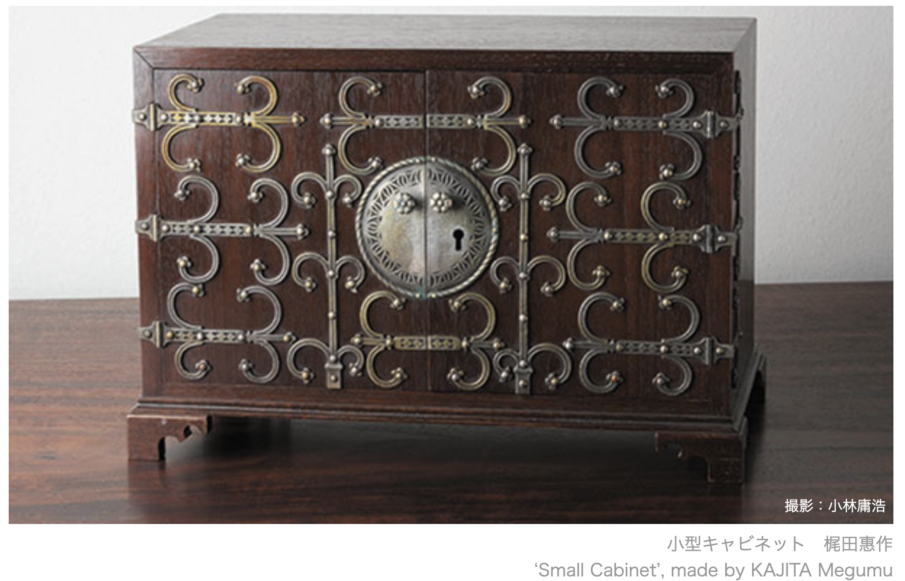

‘Small Cabinet’, made by KAJITA Megumu

** Detail

#+ATTR_HTML: :style max-height: 30vh; width: auto; object-fit: contain;
[[./images/hist2.png]]
- Detailed plans with dimensions for a small cabinet
- Kajita Megumu (梶田惠作). Kajita was a seminal figure in modern Japanese woodworking and a primary influence on the transition from traditional guild-based "copying" to the systematic, architectural design that Suda Kenji practices today.

** Detail

#+ATTR_HTML: :style max-height: 30vh; width: auto; object-fit: contain;
[[./images/hist3.png]]

- Kajita Megumu was a professor at the Tokyo University of the Arts and was instrumental in teaching the "academic" side of woodworking. The Suda family (starting with Sogetsu and Sosui) moved in these high-level circles where the drawing (the blueprint) became as important as the chiseling.
 (Source: https://www.a-quad.jp/exhibition/097/p07.html)

* Sun and Moon (2023)

#+ATTR_HTML: :style max-height: 50vh; width: auto; object-fit: contain;
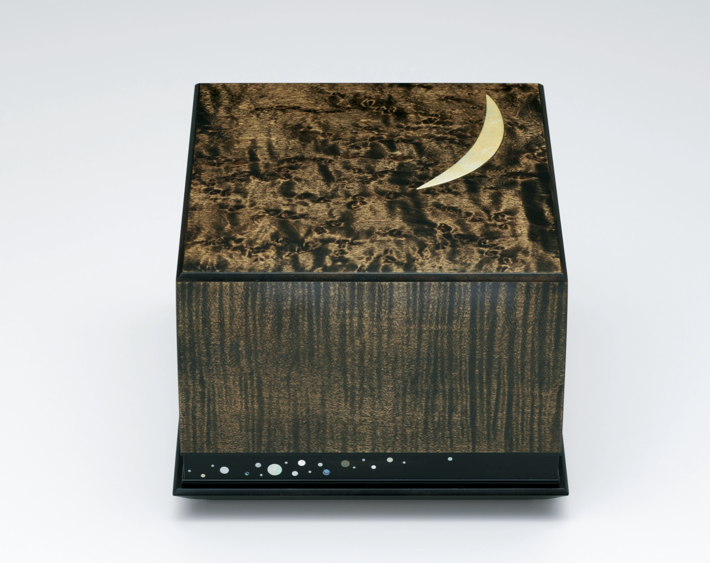

** Details

#+ATTR_HTML: :style max-height: 20vh; width: auto; object-fit: contain;

- wiped lacquer finish
- H 10.5 x W 13.8 x D 13.8 cm
- Maple and Bamboo

* Auspicious Cloud Over Paulownia Flower (2018)

#+ATTR_HTML: :style max-height: 50vh; width: auto; object-fit: contain;
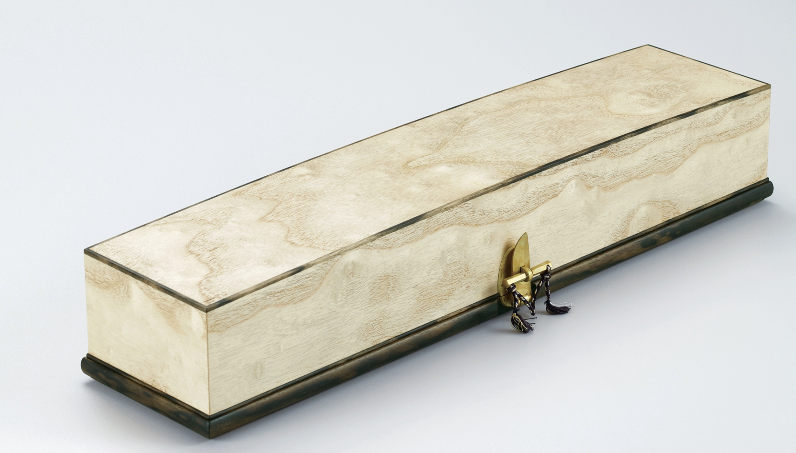
** Detail
- Paulownia wood

-  7.2 x W 9.5 x D 40.0 cm  (narrower but twice as long as a loaf of store bread)
#+caption: endgrain of Paulownia wood  (source: wood-database.com)
#+ATTR_HTML: :style max-height: 30vh; width: auto; object-fit: contain;
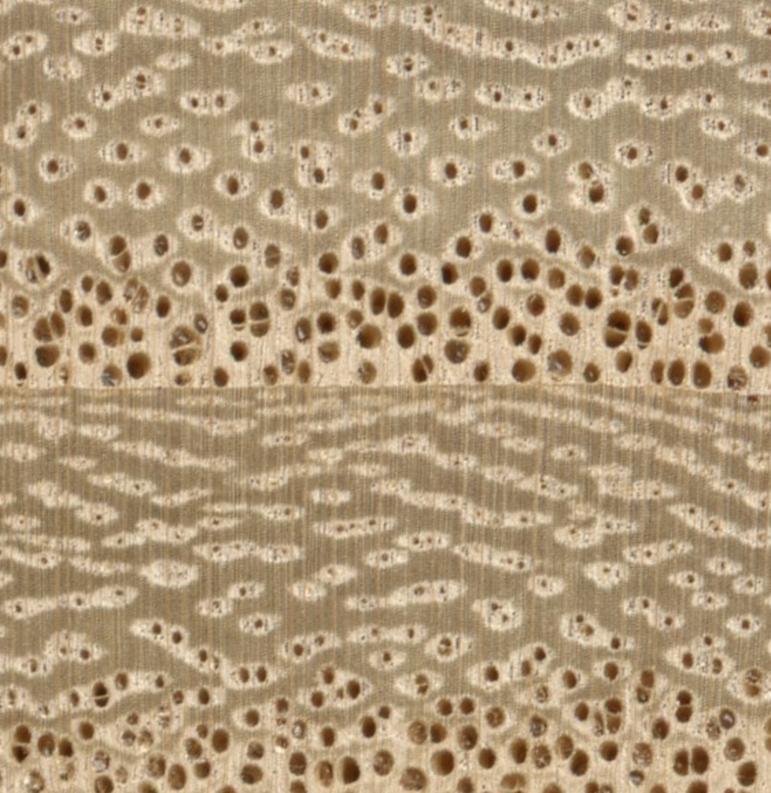

* A Tale of Two Cities (2012)

Japanese Traditional Art on Gallery Japan

#+ATTR_HTML: :style max-height: 50vh; width: auto; object-fit: contain;
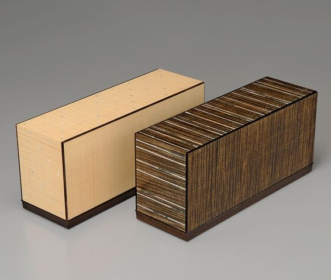

** Detail

#+ATTR_HTML: :style max-height: 30vh; width: auto; object-fit: contain;

 Maple and Shell create a more "urban" and "global" aesthetic. Sharp clean lines and the high-contrast grain between the two boxes
- Primary Woods: Maple (楓 - Kaede), Jilicote, and Granadilla.
- Inlay Materials: White Mother-of-Pearl and Paua Shell.
- Finish: Fuki-urushi (wiped lacquer), highlights natural grain

* Small Box of Zelkova Finished in Wiped Urushi (2022).

#+ATTR_HTML: :style max-height: 50vh; width: auto; object-fit: contain;
[[./images/z.png]]

** Analysis
- The 62th East Japan Traditional Kōgei Exhibition (2022)

- Zelkova is famous for its bold, "mountains and rivers" grain. In this piece, Suda has selected a cut where the grain lines are broad and stable.
#+caption: endgrain of zelkova (source: wood-database.com)
#+ATTR_HTML: :style max-height: 30vh; width: auto; object-fit: contain;
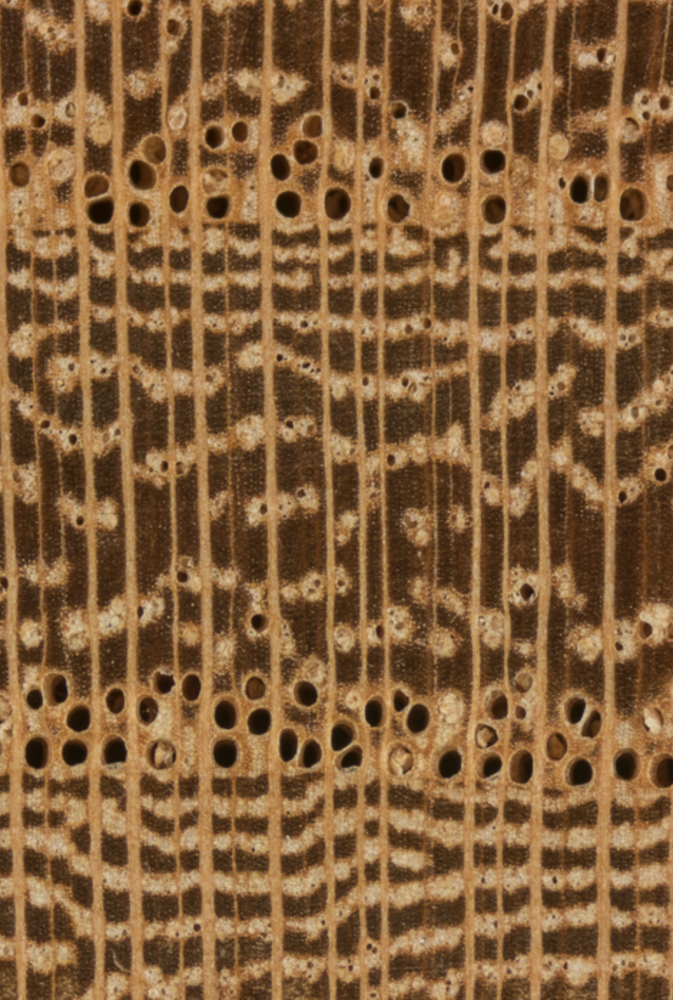

* Seal Box in Parquetry Walnut, "Shibien" (1997)

#+ATTR_HTML: :style max-height: 50vh; width: auto; object-fit: contain;
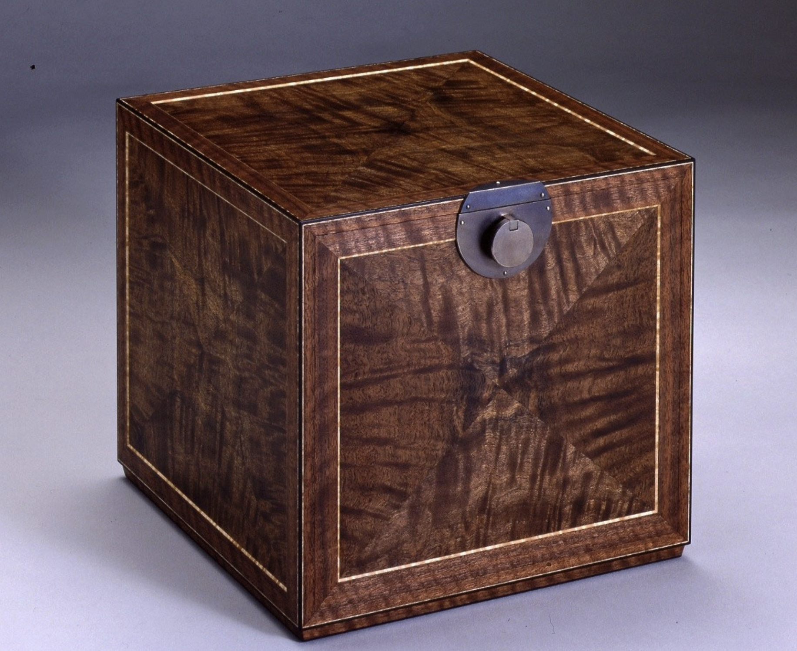

** Detail (1997)

#+ATTR_HTML: :style max-height: 50vh; width: auto; object-fit: contain;
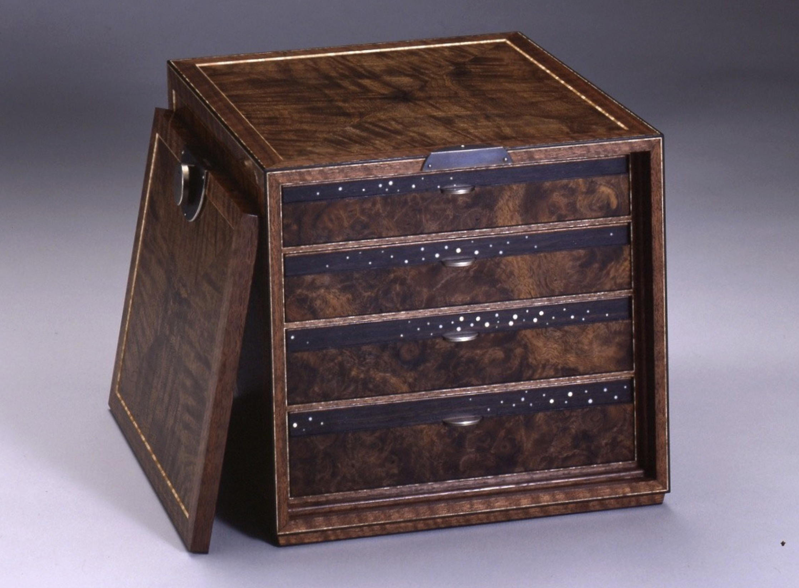
** Suda's Explanation

#+ATTR_HTML: :style max-height: 20vh; width: auto; object-fit: contain;

"I am surprised that it has been 28 years since I made this work, and at the same time, I remember the time of production as if it were yesterday. Walnuts are special walnuts from the United States called "Claro Walnut". The rooting part of a large timber with a diameter of nearly 1 meter is made of four pieces of parquet in a diagonal line to make up each side. It has a slightly purplish brown color, which is suitable for the general term for stars centered on the North Star. It is a pity that the door is closed and you cannot see the inside , but the four-tier drawer is included.""

* Ohotera: Table of Pear and Locust (2024)
  :PROPERTIES:
  :CUSTOM_ID: slide-t1-intro
  :END:

#+BEGIN_EXPORT html

  

    
  

  

    <ul style="list-style-type: none; padding-left: 0;">
      <li style="margin-bottom: 10px;"><strong>Artist:</strong> Kenji Suda [須田賢司]</li>
      <li style="margin-bottom: 10px;"><strong>Status:</strong> Living National Treasure</li>
      <li style="margin-bottom: 10px;"><strong>Typology:</strong> Functional Furniture / Wood Art</li>
      <li style="margin-bottom: 10px;"><strong>Dimensions:</strong> H 32.0 × W 114.0 × D 46.0 cm</li>
      <li style="margin-bottom: 10px;"><strong>Value:</strong> ¥1M - 6M ($6.5k - $40k USD)</li>
    </ul>
  

#+END_EXPORT

** Concept, Structure & Materiality
  :PROPERTIES:
  :CUSTOM_ID: slide-t1-technical
  :END:

- **Concept:** Organizing rectilinear planes with a "Seiga" (refined purity) motif. The formal elements emphasize horizontal massing, where the "S-curve" of the leg-to-apron transition creates a fluid line from the ground to the surface.
- **Structure:** A **codependent** structural system. The table utilizes traditional *Sashimono* (blind joinery) to handle the tension of the cantilevered top. The relationship between the low height (32cm) and the wide span (114cm) requires high-precision compression joints to prevent racking without metal hardware.
- **Materials:** Deploys **Kenponashi** (Japanese Raisin Tree/Pear) for its refined grain and **Enju** (Japanese Pagoda/Locust) for structural density. These choices balance the aesthetic need for "shimmer" with the functional requirement of a load-bearing surface.

** Process, Details & Context
  :PROPERTIES:
  :CUSTOM_ID: slide-t1-context
  :END:

#+BEGIN_EXPORT html

  

    <ul style="list-style-type: none; padding-left: 0;">
      <li style="margin-bottom: 12px;"><strong>Process:</strong> Fabricated using 2,000-year-old assembly methods, planed by hand to achieve a "wiped" finish that highlights the grain. The process itself is the aesthetic; every joint interface is a visible testament to mastery.</li>
     <li style="margin-bottom: 12px;"><strong>Context:</strong> Designed for high-end residential or traditional <em>Washitsu</em> (Japanese room) environments. Targets elite collectors/museums, justified by Suda's status and the "complete" technical mastery required for glue-less joinery.</li>
    </ul>
  

  

    
  

#+END_EXPORT

* Sycamore Maple Box (2019)
  :PROPERTIES:
  :CUSTOM_ID: slide-1
  :END:

#+ATTR_HTML: :style max-height: 50vh; width: auto; object-fit: contain;
  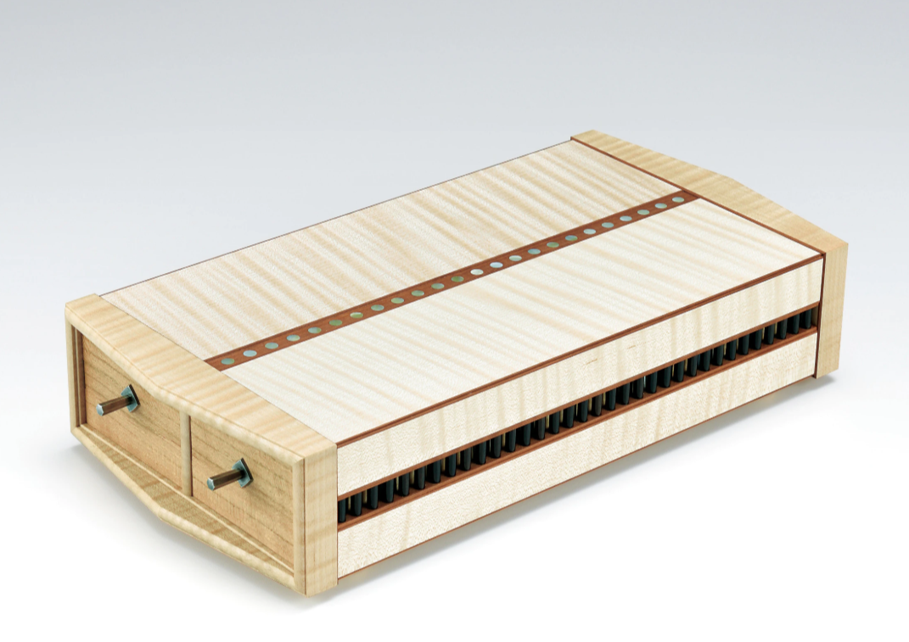

  - *Artisan:* Carpenter (Sashimono Specialist)
  - *Material:* Curly Maple (Sycamore)
  - *Exhibition:* 66th Japan Traditional Crafts (2019)

** Concept, Structure & Materiality
  :PROPERTIES:
  :CUSTOM_ID: slide-2
  :END:

  - *Concept:* Formal organization of rectilinear planes and rhythmic repetition; grain "chatoyancy" contrasts with dark vertical massing.
  - *Structure:* Codependent *Sashimono* (blind joinery) system; relies on precision-fit compression and mechanical locking without fasteners.
  - *Materials:* Curly Maple selected for aesthetic shimmer and high structural density; technology of the hand expressed through grain-matching.

** Process, Details & Context
  :PROPERTIES:
  :CUSTOM_ID: slide-3
  :END:

  - *Process:* Sequential interlocking of *tsugite* joints; fabrication is elevated to an aesthetic by exposing joinery as a serrated decorative element.
  - *Details:* Large maple chassis; Medium rhythmic joinery "teeth"; Small metal pins and circular surface inlays.
  - *Context:* Functional sculpture for institutional/collector environments; labor-intensive fabrication justifies high-end retail price point.

* Yatsuhashi II: Claro Walnut and Cherry Wood Table
  :PROPERTIES:
  :CUSTOM_ID: slide-1
  :END:

#+ATTR_HTML: :style max-height: 50vh; width: auto; object-fit: contain;
  [[./images/d2.png]]

  - *Artisan:* Kenji Suda (Living National Treasure)
  - *Material:* Claro Walnut and Cherry Wood
  - *Dimensions:* H 72.0 x W 160.0 x D 135.0 cm

** Concept, Structure & Materiality
   :PROPERTIES:
   :CUSTOM_ID: slide-2
   :END:

#+BEGIN_EXPORT html

  

    
  

  

    <ul style="list-style-type: none; padding-left: 0;">
      <li style="margin-bottom: 15px;"><strong>Concept:</strong> Formal organization of rectilinear planes and rhythmic repetition; grain "chatoyancy" contrasts with dark vertical massing.</li>
      <li style="margin-bottom: 15px;"><strong>Structure:</strong> Codependent <em>Sashimono</em> (blind joinery) system; relies on precision-fit compression and mechanical locking without fasteners.</li>
      <li style="margin-bottom: 15px;"><strong>Materials:</strong> Curly Maple selected for aesthetic shimmer and high structural density; technology of the hand expressed through grain-matching.</li>
    </ul>
  

#+END_EXPORT

** Process, Details & Context
  :PROPERTIES:
  :CUSTOM_ID: slide-3
  :END:

  - *Process:* Fabricated using high-precision *Sashimono* (wood joinery) and finished in wiped lacquer (*urushi*) to accentuate the grain without masking the tactile surface.
  - *Details:* Large interlocking walnut planks; Medium cherry structural beams; Small precisely carved joint interfaces where the "planks" meet the frame.
  - *Context:* A monumental functional sculpture intended for institutional or high-end residential interiors; its status as a work by a Living National Treasure places it in a high-luxury price bracket for serious collectors.

* Analysis Work: (double box)

#+ATTR_HTML: :style max-height: 60vh; width: auto; object-fit: contain;
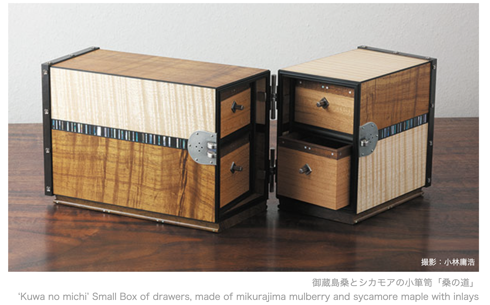

** Opening display view

[[./images/openBox2.gif]]
** Detail
[[./images/boxDetail.gif]]

* Rikuri (2008)

#+ATTR_HTML: :style max-height: 50vh; width: auto; object-fit: contain;
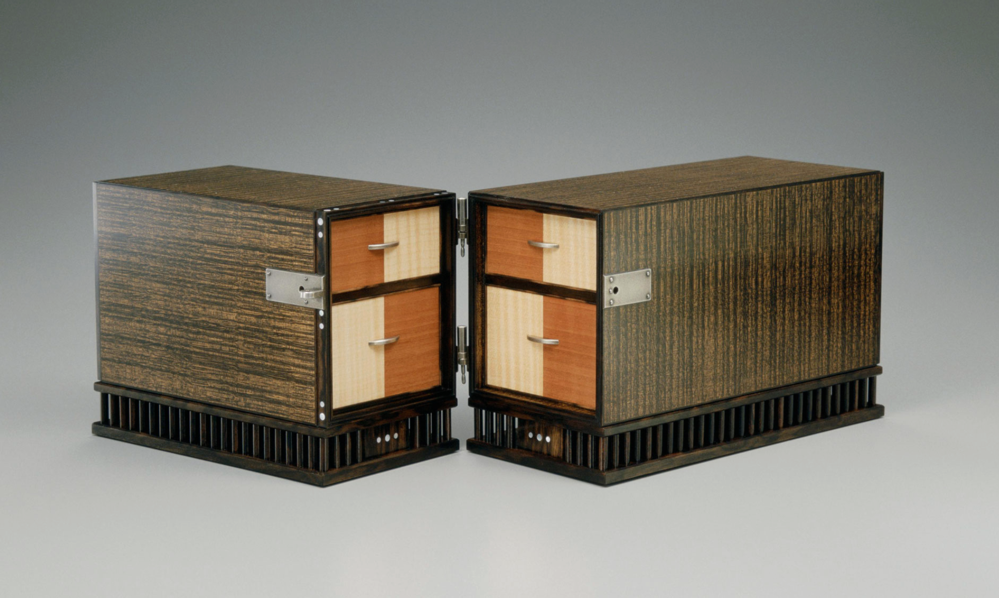
** Detail
#+ATTR_HTML: :style max-height: 20vh; width: auto; object-fit: contain;

- Rikuri is a poetic, somewhat archaic term meaning "Dazzling," "Glittering," or "Resplendent." It often describes something with a multi-colored or shimmering brilliance (like light hitting the maple grain through the lacquer).
- 所蔵：宮内庁 (Shozō: Kunaichō): Collection: Imperial Household Agency. The piece was acquired by or gifted to the Japanese Imperial Family and is part of their official collection.

* Philosophy: Craft as Life [生活 - Seikatsu]
  :PROPERTIES:
  :CUSTOM_ID: philosophy
  :END:

#+BEGIN_EXPORT html

  

    <ul style="list-style-type: none; padding-left: 0;">
      <li style="margin-bottom: 12px;"><strong>Beyond Work:</strong> For Suda, being in the workshop is not "labor" but simply <em>living</em>. The act of creation is inseparable from existence.</li>
      <li style="margin-bottom: 12px;"><strong>Mederu [愛でる]:</strong> The philosophy of "loving and cherishing" ordinary objects. He believes beauty must be rooted in the home and daily use, not just the gallery.</li>
      <li style="margin-bottom: 12px;"><strong>Nature’s Revelation:</strong> As seen in his <em>Suiko</em> and <em>Tsukuhae</em> boxes, he planed a blackened, discarded log to reveal grain patterns like "moonlight on dark water."</li>
    </ul>
  

  

    
  

#+END_EXPORT

* Sources 1
#+begin_export html

  <h3 style="color: #2c3e50; margin-top: 0;">Reference Materials</h3>

  <ul style="line-height: 1.6;">
    <li><strong>Material Science:</strong> <a href="https://www.wood-database.com/paulownia/" target="_blank">Paulownia (Kiri) Technical Data</a> - Focus on hygroscopic properties.</li>
    <li><strong>Documentary:</strong> <a href="https://www.youtube.com/watch?v=epCgloUe9dU" target="_blank">Making Beauty: Suda Kenji</a> (British Museum) - National Treasure Overview.</li>
    <li><strong>Technical Analysis:</strong> <a href="https://www.youtube.com/watch?v=a477Ezh0sww&t=23s" target="_blank">Words on Kigumi (Joinery)</a> (Takenaka Museum) - Ash Box & Urushi focus.</li>
    <li><strong>Philosophy:</strong> <a href="https://www.youtube.com/watch?v=P2L-pCstH5M" target="_blank">The World of Seiga (清雅)</a> (Gunma Prefecture) - The core of Suda's "Pure Elegance."</li>
    <li><strong>Lineage Data:</strong> <a href="https://artmuseum.pref.hokkaido.lg.jp/database/artist/2817" target="_blank">Grandfather: Suda Sōgetsu (須田 桑月)</a> - Historical Archive.</li>
    <li><strong>Official Bio:</strong> <a href="https://japanwoodcraftassociation.com/masters/suda-kenji/" target="_blank">Master Suda Kenji Biography</a> - Japan Woodcraft Association.</li>
  </ul>

  

    <em>Scale Reference: 7.2 x 9.5 x 40.0 cm (Stationery Box Proportions)</em>
  

#+end_export

* Sources 2

#+begin_export html

  <h4 style="margin-top: 0; color: #8e44ad;">Historical Blueprint Archive</h4>
  

    <strong>Source:</strong> <a href="https://www.a-quad.jp/exhibition/097/p07.html" target="_blank" style="color: #2980b9; text-decoration: none; font-weight: bold;">Gallery A4: Woodworking - With Pure Elegance as a Guide (Page 7)</a>
  

  <ul style="font-size: 0.95em; color: #34495e;">
    <li><strong>Subject:</strong> Detailed Plans (詳寸図) by <strong>Kajita Megumu (梶田惠作)</strong>.</li>
    <li><strong>Origin:</strong> Collection of the University Art Museum, Tokyo University of the Arts.</li>
    <li><strong>Significance:</strong> Represents the archetypal 1:1 scale drawings for <em>Sashimono</em> small cabinets and cigarette cases that influenced the Suda family's architectural design process.</li>
  </ul>
  <footer style="font-size: 0.8em; color: #7f8c8d; border-top: 1px solid #eee; padding-top: 5px;">
    Exhibition Title: 木工藝 清雅を標に－人間国宝 須田賢司の仕事－
  </footer>

#+end_export
