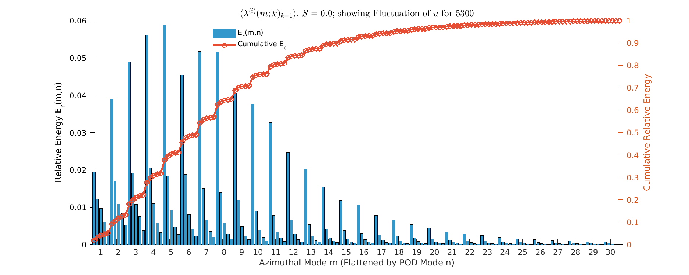
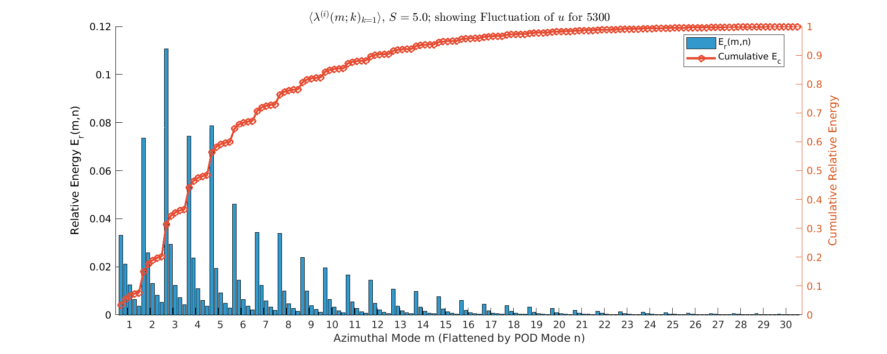
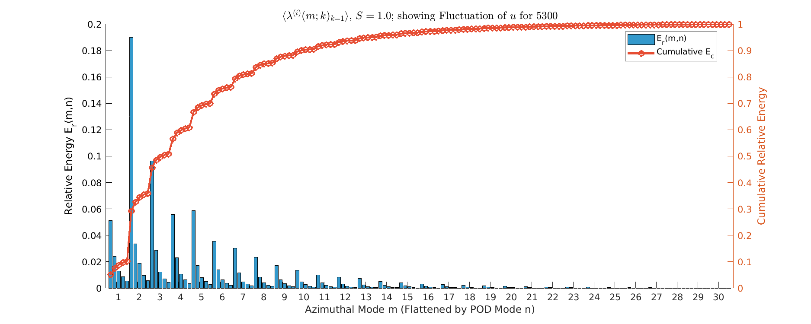
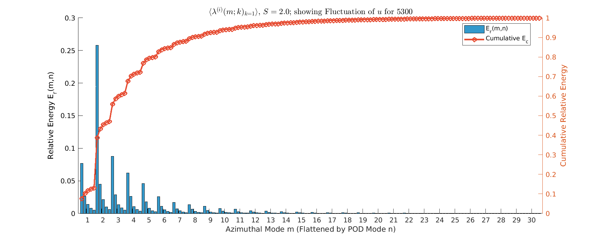

#+TITLE: POD Analysis of Turbulent Pipe Flow
#+AUTHOR: M. Raba
#+LATEX_COMPILER: xelatex
# this is the size i usually use:
#+LATEX_header: ​\geometry{paperwidth=700pt, paperheight=2000pt}

#+REVEAL_THEME: serif
#+REVEAL_EXTRA_CSS: style.css
#+REVEAL_ROOT: https://cdn.jsdelivr.net/npm/reveal.js@4.6.0/
#+REVEAL_INIT_OPTIONS: controls:true, progress:true, slideNumber:true, transition:'fade'
#+OPTIONS: toc:nil num:nil

#+HTML_HEAD: 

#+LATEX_HEADER:\setcounter{MaxMatrixCols}{20}
# #+latex_header: \mode<beamer>{\usetheme{league}}
# #+latex_header:\usepackage{xeCJK}
#+latex_header:\usepackage{fontspec}
#+latex_header:\setmonofont{DejaVu Sans Mono}
# #+latex_header:\setmainfont{Avenir LT Std}
# #+latex_header:\setsansfont{Avenir LT Std}
# #+latex_header:\setsansfont{SF UI Text}
# #+latex_header: \setbeamerfont{section}{size=\scriptsize,series=\bfseries,parent=structure}
# #+latex_header: \setbeamerfont{section}{font=EB Garamond}

#+latex_header: \usepackage{setspace}
#+latex_header: \onehalfspacing
#+OPTIONS: toc:nil
# #+OPTIONS: toc:t
#+LATEX_HEADER: \usepackage{booktabs}
#+LATEX_HEADER:  \usepackage[table]{xcolor}
#+LATEX_HEADER: \usepackage{colortbl}
#+LATEX_HEADER:  \usepackage{sectsty}
#+LATEX_HEADER:  \usepackage{soul}
#+LATEX_HEADER: \allsectionsfont{\normalfont\sffamily\bfseries}
#+LATEX_HEADER: \usepackage{microtype}
#+LATEX_HEADER:\usepackage{siunitx}
#+LATEX_HEADER:\usepackage{physics}
# #+LATEX_HEADER:\usepackage{amsmath}
#+LATEX_HEADER:\usepackage[tikz]{bclogo}
# #+latex_header:\usepackage[citestyle=authoryear-icomp,bibstyle=authoryear, hyperref=true,backref=true,maxcitenames=3,url=true,backend=biber,natbib=true]{biblatex}
#+latex_header:\usepackage[style=authoryear-icomp,bibstyle=authoryear, hyperref=true,backref=true,maxcitenames=3,url=true,backend=biber,natbib=true]{biblatex}
# #+latex_header:\addbibresource{bib.bib}
#+latex_header:\bibliography{bib.bib}
# #+latex_header:\addbibresource{bib}
# #+latex_header:\setmainfont[Variant = 1, Ligatures = {Common,Rare}]{Zapfino}%
# #+latex_header: ​\setmathsfont(Digits)[Numbers={Lining, Proportional}]{Fira Sans Light}
# #+latex_header:\usepackage[cache=false]{minted}
#+latex_header:\usepackage{minted,xcolor}
# #+latex_header:\usemintedstyle{monokai}
#+latex_header:\usemintedstyle{manni}
# #+latex_header:\usemintedstyle{perldoc}
# #+latex_header:\definecolor{bg}{HTML}{282828}
# #+latex_header:\definecolor{bg}{HTML}{4d1933} # dark purple color
# #+latex_header:\definecolor{bg}{HTML}{fdffcf} # yellow
#+latex_header:\definecolor{bg}{HTML}{ffffe6}
#+latex_header:\setminted{bgcolor=bg}
#+latex_header:\setminted{linenos}
# #+latex_header:\setminted{fontsize=\large}
# #+latex_header:\setminted{framesep=2mm}
# #+latex_header:\setminted{escapeinsid=e||,mathescape}
#+latex_header:\definecolor{Tiffany}{HTML}{00ffdd}
#+latex_header:\setbeamercolor{alerted text}{fg=Orange}
#+latex_header:\setbeamercolor{frametitle}{bg=tyrianPurple}
#+latex_header: \usepackage{tikz}
#+latex_header: \metroset{block=fill}

* Outline: Physics, Relam Goal, Tools
* Relaminarization

** Energy $S=0$

** Energy $S=0.5$

** Energy $S=1$

** Energy $S=2$

** Energy $S=3$

* Validation of the POD
* POD Formulation: Weighted \(L^2\) Structure
** POD Formulation: Weighted \(L^2\) Structure

#+BEGIN_EXPORT html

<!-- Left Column -->

Deriving POD Coefficients in Weighted \(L^2\)

We begin with the spatiotemporal correlation tensor
defined for each azimuthal and axial wavenumber pair \((k,m)\):

\[
S(k;m;r,r') = \lim_{\tau\to\infty}\frac{1}{\tau}\int_0^\tau
u(k;m;r,t)\,u^*(k;m;r',t)\, dt
\tag{2.2}
\]

The method of snapshots assumes separability in space and time,
leading to the projection coefficients:

\[
\alpha^{(n)}(k;m;t)
= \int_r u(k;m;r,t)\,\phi^{(n)*}(k;m;r)\,dr
\tag{2.3}
\]

<!-- Right Column -->

Reformulated Eigen Problem

The temporal correlation tensor is

\[
R(k;m;t,t') = \int_r u(k;m;r,t)\,u^*(k;m;r,t')\,dr
\]

The POD coefficients satisfy

\[
\lim_{\tau\to\infty} \frac{1}{\tau}\int_0^\tau
R(k;m;t,t')\,\alpha^{(n)}(k;m;t')\,dt'
= \lambda^{(n)}(k;m)\,\alpha^{(n)}(k;m;t)
\tag{2.4}
\]

And the spatial modes recover as

\[
\phi^{(n)}_T(k;m;r)=
\lim_{\tau\to\infty}\frac{1}{\tau}\int_0^\tau
u_T(k;m;r,t)\,\alpha^{(n)*}(k;m;t)\,dt
\tag{2.5}
\]

#+END_EXPORT

** Motivation: Large-Scale Motions in Pipe Flow

#+BEGIN_EXPORT html

<!-- Left Column: Text -->

Targeting Energetic Coherent Structures

<ul style="font-size: 1.1em; line-height: 1.6; color: #34495e;">
<li><b>Context:</b> Turbulent pipe flow is dominated by Very-Large-Scale Motions (VLSMs), which contain a significant fraction of the turbulent kinetic energy.</li>
<li><b>Take Care:</b> POD collapse infinite-d vector space to countable indexed vector space (property of compact operator). Operator must be symmetric, and compact with regard to the weighted infinite-d weighted inner product, not the cartestian inner product  </li>
<li><b>Why POD?</b> Proper Orthogonal Decomposition (POD) provides the most efficient basis (in an \(L^2\) sense) to represent these energetic flow structures.</li>
<li><b>Why FFT-POD?</b> FFT in azimuthal direction reduces problem further! Going from 3d problem to 1d problem in \(t\). </li>
</ul>

<!-- Right Column: Key Takeaway -->

LSM \(\Rightarrow\) small azimuthal wave number

The largest structures in pipe flow are strongly associated with low azimuthal wavenumbers ($m$). We can recover a velocity component with good resolution with few number of POD modes (say 5), and a decent number of azimuthal modes (say around 25).

<small style="color: #7f8c8d;">This spectral separation is the foundation of the methodology.</small>

#+END_EXPORT

** Spectral Decomposition Approach

#+BEGIN_EXPORT html

<!-- Left Column: Text -->

Theoretical Framework

<ul style="font-size: 1.1em; line-height: 1.6; color: #34495e;">
<li><b>Objective:</b> Extract energetic coherent structures from turbulent pipe-flow data. </li>
<li><b>Spectral Step:</b> Because the flow is homogeneous in the azimuthal direction, an FFT in $\theta$ gives complex-valued azimuthal modes \(\hat{u}_m(r,t)\).</li>
<li><b>Result:</b> POD is performed independently for each \(m\), reducing dimensionality and ensuring Hermitian symmetry for physical (real) reconstructions.</li>
</ul>

<!-- Right Column START: Visual/Eq Box Shell -->

Spectral Decomposition

#+END_EXPORT

$$u(r, \theta, t)
= \sum_{m=-M}^{M} \hat{u}_m(r, t)\, e^{i m \theta},
\qquad \hat{u}_{-m}=\hat{u}_m^{*}$$

#+BEGIN_EXPORT html

Real-valued physical fields require Hermitian symmetry across $m$.

#+END_EXPORT

** Weighted Inner Product and Correlation Matrix

#+BEGIN_EXPORT html

<!-- Left Column: Theory -->

Snapshot POD in Weighted \(L^2\) Space

To preserve kinetic-energy orthogonality in cylindrical coordinates, the POD uses a weighted inner product
with weight matrix \( W = \mathrm{diag}(r_1\Delta r,\dots,r_{N_r}\Delta r) \) representing both geometry \( r \) and quadrature \( \Delta r \).

<b>Snapshot Matrix:</b>

\( X = [\hat{u}_1,\,\hat{u}_2,\dots,\hat{u}_{N_s}] \in \mathbb{C}^{N_r \times N_s} \). The radial coordinate \( r \) acts as the weight \( R \) in the inner product.

<!-- Right Column: Equations -->

Weighted Inner Product

#+END_EXPORT

$$\langle f, g\rangle_R
= \int_0^R f^*(r)\, r\, g(r)\, dr
\;\;\Longrightarrow\;\;
\langle f, g\rangle_R = f^* W g$$

#+BEGIN_EXPORT html

Continuous POD Eigenproblem

#+END_EXPORT

$$\int_0^R C_m(r, r') \, \phi_{k,m}(r') \, r' \, dr' = \lambda_{k,m} \, \phi_{k,m}(r)$$

#+BEGIN_EXPORT html

Weighted Correlation Matrix (Snapshot Method)

#+END_EXPORT

$$K = X^\ast W X$$

#+BEGIN_EXPORT html
<small style="color: #7f8c8d;">This ensures energy-consistent POD modes in cylindrical geometry.</small>

#+END_EXPORT

** Eigenvalue Problem (Snapshot POD)

#+BEGIN_EXPORT html

<!-- Left Column -->

Temporal Eigenproblem

Solving the snapshot POD eigenproblem gives the temporal coefficients as eigenvectors, and the modal energies as eigenvalues.
If the mean field exists, it must be removed: \(\hat{u}&#39; = \hat{u} - \overline{u}\).

<!-- Right Column -->

Snapshot POD Eigenproblem

#+END_EXPORT

$$K\, a^{(k)} = \lambda_k\, a^{(k)}$$

#+BEGIN_EXPORT html
<small style="color: #7f8c8d;">$a^{(k)}$: temporal eigenvectors, $\lambda_k$: POD modal energies</small>

#+END_EXPORT

** Back-Transformation to Physical Space

#+BEGIN_EXPORT html

<!-- Left Column -->

Recovering Spectral Spatial Modes \(\phi_k(r)\)

The spectral spatial POD modes are recovered by projecting the eigenvectors back onto the snapshot matrix. These modes are functions of the radial coordinate \(r\) only.

<!-- Right Column -->

Spatial Mode (Correctly Normalized)

#+END_EXPORT

$$\phi_k
= \frac{1}{\sqrt{\lambda_k}}\, X\, a^{(k)}
\quad\text{(if $K = X^\ast W X$ was used)}$$

#+BEGIN_EXPORT html

Alternative (Weighted Projection)

#+END_EXPORT

$$\phi_k
= \frac{1}{\sqrt{\lambda_k}}\, W\, X\, a^{(k)}
\quad\text{(if $K = X^\ast X$ was used)}$$

#+BEGIN_EXPORT html

#+END_EXPORT

** Time Coefficients

#+BEGIN_EXPORT html

<!-- Left Column -->

Temporal Dynamics Recovery

The time coefficients \(b_k(t)\) are the instantaneous amplitude of the corresponding spatial mode \(\phi_k\).

<!-- Right Column -->

Using Eigenvectors (Used Method)

#+END_EXPORT

$$b_k(t_i) = a^{(k)}_i \sqrt{\lambda_k}$$

#+BEGIN_EXPORT html

Via Weighted Projection (Alternative)

#+END_EXPORT

$$b_k(t_i) = \langle \phi_k, \hat{u}_i \rangle_R
= \phi_k^\ast W\, \hat{u}_i$$

#+BEGIN_EXPORT html

#+END_EXPORT

** Field Reconstruction

#+BEGIN_EXPORT html

<!-- Left Column -->

Final Reconstruction and Visualization

The reconstructed spectral field is built from selected POD modes $k=1..P$ and azimuthal modes $m$.
The final physical field is obtained via an inverse FFT in the azimuthal direction.

<b>Implementation Note (from MATLAB code):</b>

<!-- Right Column -->

Spectral Reconstruction

#+END_EXPORT

$$\hat{u}_{recon}(r,t)
= \sum_{m=M_\min}^{M_\max}
  \sum_{k=1}^{P}
  b_{k,m}(t)\,\phi_{k,m}(r)$$

#+BEGIN_EXPORT html

Physical Reconstruction

#+END_EXPORT

$$\tilde{u}_{recon}(r,\theta,t)
= \mathrm{IFFT}_\theta\!\left[
\hat{u}_{recon}(r,t)
\right]$$

#+BEGIN_EXPORT html

#+END_EXPORT
