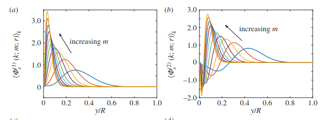
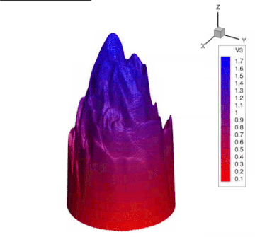
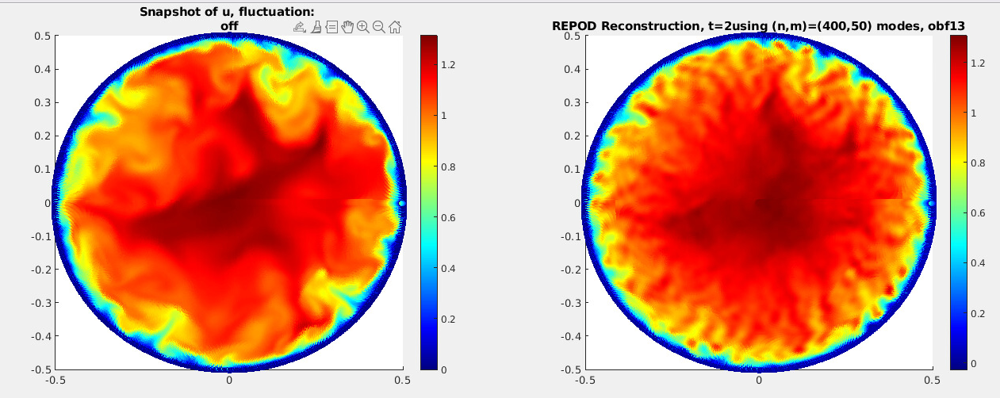
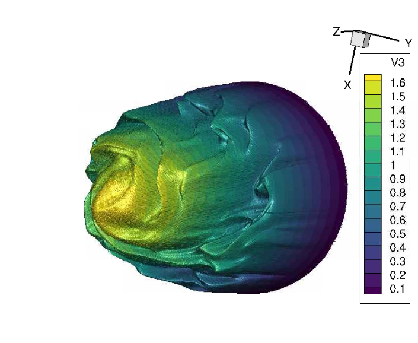
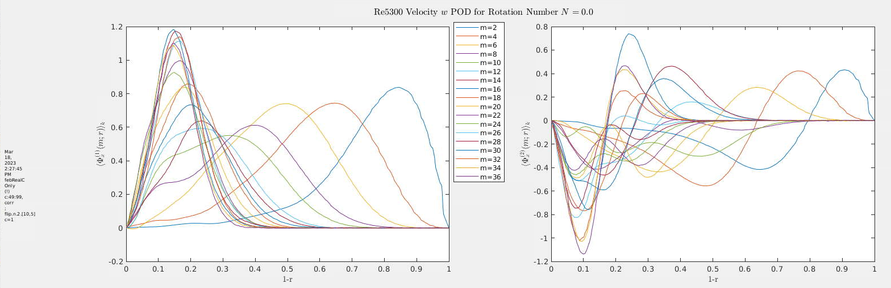
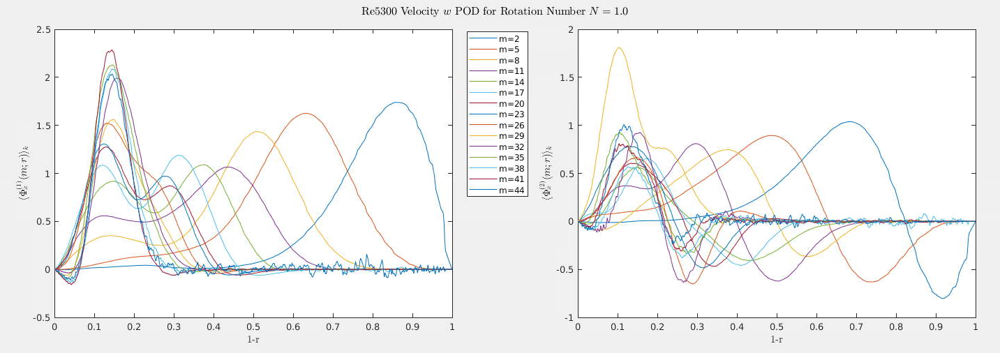
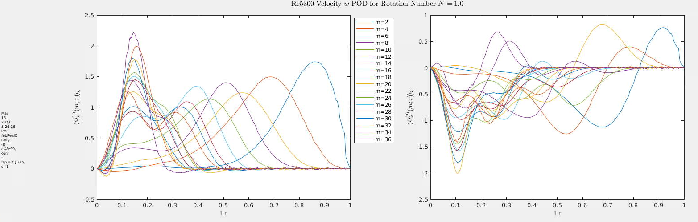
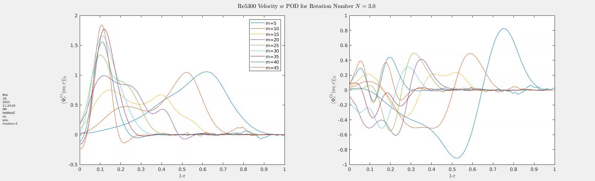
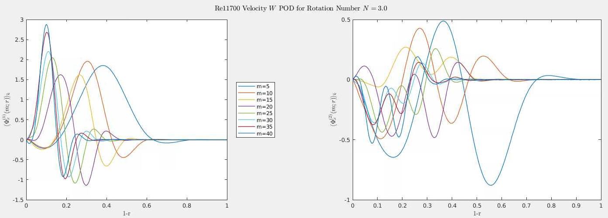

#+TITLE: POD Analysis of Turbulent Pipe Flow
#+AUTHOR: M. Raba
#+LATEX_COMPILER: xelatex
# this is the size i usually use:
#+LATEX_header: ​\geometry{paperwidth=700pt, paperheight=2000pt}

#+REVEAL_THEME: serif
#+REVEAL_EXTRA_CSS: style.css
#+REVEAL_ROOT: https://cdn.jsdelivr.net/npm/reveal.js@4.6.0/
#+REVEAL_INIT_OPTIONS: controls:true, progress:true, slideNumber:true, transition:'fade'
#+OPTIONS: toc:nil num:nil

#+HTML_HEAD: 

#+LATEX_HEADER:\setcounter{MaxMatrixCols}{20}
# #+latex_header: \mode<beamer>{\usetheme{league}}
# #+latex_header:\usepackage{xeCJK}
#+latex_header:\usepackage{fontspec}
#+latex_header:\setmonofont{DejaVu Sans Mono}
# #+latex_header:\setmainfont{Avenir LT Std}
# #+latex_header:\setsansfont{Avenir LT Std}
# #+latex_header:\setsansfont{SF UI Text}
# #+latex_header: \setbeamerfont{section}{size=\scriptsize,series=\bfseries,parent=structure}
# #+latex_header: \setbeamerfont{section}{font=EB Garamond}

#+latex_header: \usepackage{setspace}
#+latex_header: \onehalfspacing
#+OPTIONS: toc:nil
# #+OPTIONS: toc:t
#+LATEX_HEADER: \usepackage{booktabs}
#+LATEX_HEADER:  \usepackage[table]{xcolor}
#+LATEX_HEADER: \usepackage{colortbl}
#+LATEX_HEADER:  \usepackage{sectsty}
#+LATEX_HEADER:  \usepackage{soul}
#+LATEX_HEADER: \allsectionsfont{\normalfont\sffamily\bfseries}
#+LATEX_HEADER: \usepackage{microtype}
#+LATEX_HEADER:\usepackage{siunitx}
#+LATEX_HEADER:\usepackage{physics}
# #+LATEX_HEADER:\usepackage{amsmath}
#+LATEX_HEADER:\usepackage[tikz]{bclogo}
# #+latex_header:\usepackage[citestyle=authoryear-icomp,bibstyle=authoryear, hyperref=true,backref=true,maxcitenames=3,url=true,backend=biber,natbib=true]{biblatex}
#+latex_header:\usepackage[style=authoryear-icomp,bibstyle=authoryear, hyperref=true,backref=true,maxcitenames=3,url=true,backend=biber,natbib=true]{biblatex}
# #+latex_header:\addbibresource{bib.bib}
#+latex_header:\bibliography{bib.bib}
# #+latex_header:\addbibresource{bib}
# #+latex_header:\setmainfont[Variant = 1, Ligatures = {Common,Rare}]{Zapfino}%
# #+latex_header: ​\setmathsfont(Digits)[Numbers={Lining, Proportional}]{Fira Sans Light}
# #+latex_header:\usepackage[cache=false]{minted}
#+latex_header:\usepackage{minted,xcolor}
# #+latex_header:\usemintedstyle{monokai}
#+latex_header:\usemintedstyle{manni}
# #+latex_header:\usemintedstyle{perldoc}
# #+latex_header:\definecolor{bg}{HTML}{282828}
# #+latex_header:\definecolor{bg}{HTML}{4d1933} # dark purple color
# #+latex_header:\definecolor{bg}{HTML}{fdffcf} # yellow
#+latex_header:\definecolor{bg}{HTML}{ffffe6}
#+latex_header:\setminted{bgcolor=bg}
#+latex_header:\setminted{linenos}
# #+latex_header:\setminted{fontsize=\large}
# #+latex_header:\setminted{framesep=2mm}
# #+latex_header:\setminted{escapeinsid=e||,mathescape}
#+latex_header:\definecolor{Tiffany}{HTML}{00ffdd}
#+latex_header:\setbeamercolor{alerted text}{fg=Orange}
#+latex_header:\setbeamercolor{frametitle}{bg=tyrianPurple}
#+latex_header: \usepackage{tikz}
#+latex_header: \metroset{block=fill}

* Background and Motivation
** Literature Review
#+BEGIN_EXPORT html

  <!-- LEFT column: Context & Relevance -->
  

    

      <i>Background and Motivation</i>
    

    
<b>Talk Title:</b> POD Analysis of Turbulent Pipe Flow

    
<b>Why Rotating Pipe Flow?</b>

    <ul style="margin-left: 1em;">
      <li>Simple geometry, yet rich in turbulent dynamics</li>
      <li>Ideal for studying rotation-induced turbulence suppression</li>
      <li>Relevant to aerospace, combustion, and industrial flows</li>
    </ul>

    
<b>Historical Observations:</b>

    <ul style="margin-left: 1em;">
      <li>Rotation reduces skin friction and pressure loss</li>
      <li>Experiments (e.g., White 1964, Kikuyama et al. 1983) showed relaminarization at high rotation rates</li>
    </ul>
  

  <!-- RIGHT column: Research Gaps & Objectives -->
  

    

      <i>Research Gaps & Objectives</i>
    

    
<b>Challenges:</b>

    <ul style="margin-left: 1em;">
      <li>Limited DNS studies at moderate-to-high Reynolds numbers</li>
      <li>RANS/LES models struggle to capture suppression mechanisms</li>
    </ul>

    
<b>Goals of This Work:</b>

    <ul style="margin-left: 1em;">
      <li>Use DNS to quantify turbulence suppression</li>
      <li>Apply POD to identify dominant coherent structures</li>
      <li>Provide benchmark data for turbulence model validation</li>
    </ul>

    

      <i>This study bridges the gap between high-fidelity simulations and reduced-order modeling of rotating turbulent flows.</i>
    

  

#+END_EXPORT

** DNS Turbulent Model
#+BEGIN_EXPORT html

  <!-- LEFT column: Simulation Context -->
  

    

      <i>DNS Configuration: Rotating Turbulent Pipe Flow</i>
    

    
<b>Flow Type:</b> Axially rotating turbulent pipe flow

    
<b>Solver:</b> Nek5000 (Spectral Element Method)

    
<b>Reynolds Numbers:</b> 5,300 and 11,700

    
<b>Rotation Numbers (N):</b> 0 to 3

    
<b>Domain:</b> Streamwise extent of 15D, periodic boundaries

    
<b>Purpose:</b> Study turbulence suppression and provide DNS benchmark data

  

  <!-- RIGHT column: Numerical & Grid Setup -->
  

    

      <i>Numerical & Grid Details</i>
    

    
<b>Time Integration:</b>

    <ul style="margin-left: 1em;">
      <li>Viscous terms: BDF3 (implicit)</li>
      <li>Nonlinear terms: Explicit extrapolation (3rd order)</li>
    </ul>

    
<b>Grid Resolution (wall units y⁺):</b>

    <ul style="margin-left: 1em;">
      <li>Radial: 0.14–4.4 (Re = 5300), 0.16–4.7 (Re = 11,700)</li>
      <li>Azimuthal: 1.5–5.0</li>
      <li>Streamwise: 3.0–9.9</li>
    </ul>

    
<b>Mesh:</b> Hexahedral elements with high-order tensor polynomials

    
<b>Parallelization:</b> MPI with auto-tuned algorithms

    
<b>Pressure Solver:</b> Algebraic Multigrid (AMG)

    
<b>Temporal Averaging:</b> Over 6.5 flow-throughs (after transient)

  

#+END_EXPORT

** Background: Rotating Pipe Flow & Relaminarization
:PROPERTIES:
:reveal_slide_number: t
:END:

#+begin_export html

<strong>Scientific Context</strong>

<ul>
<li>Rotating pipe flow is a canonical system for studying flow stabilization and relaminarization.</li>
<li>Rotation modifies turbulence production and redistributes momentum through Coriolis and centrifugal effects.</li>
<li>Relaminarization occurs when rotation suppresses the near-wall turbulence regeneration cycle.</li>
</ul>

<strong>Key Phenomena</strong>

<ul>
<li>Competition between destabilizing wall shear and stabilizing radial pressure gradients.</li>
<li>Reduction in Reynolds stresses and near-wall streaks at high rotation rates.</li>
<li>Relaminarized or quasi-laminar states can persist at high Reynolds numbers.</li>
</ul>

[1] White (1964), <em>J. Fluid Mech.</em> — early rotating pipe experiments.  
[2] Kikuyama et al. (1983), <em>JSME Int. J.</em> — visualization of relaminarization.  
[3] Imao (1996), <em>Exp. Fluids</em> — centrifugal stabilization and mean profiles.

#+end_export

** DNS, Theory, and Modal Decomposition
:PROPERTIES:
:reveal_slide_number: t
:END:

#+begin_export html

<strong>DNS and Analytical Foundations</strong>

<ul>
<li>DNS captures relaminarization at Re = 10⁴–10⁵ under rotation.</li>
<li>Scaling and symmetry analyses (Oberlack, 1999; 2001) relate turbulence structure to invariants.</li>
<li>Hellström et al. (2017) provide reproducible experimental and DNS methodology for relaminarization.</li>
</ul>

<strong>Modal Analysis (POD)</strong>

<ul>
<li>Proper Orthogonal Decomposition (POD) identifies energy-dominant coherent structures.</li>
<li>Developed by Lumley (1967); extended by Taira et al. (2017) for complex turbulent systems.</li>
<li>Recent studies (Brehm 2019; Ashton 2019) combine DNS and POD for energy transfer diagnostics.</li>
</ul>

[1] Orlandi & Fatica (1997), <em>J. Fluid Mech.</em> — first DNS of rotating pipe turbulence.  
[2] Feiz & Tavoularis (2005), <em>Phys. Fluids</em> — DNS of turbulent pipe under rotation.  
[3] Hellström et al. (2017), <em>Phys. Rev. Fluids</em> — experimental/DNS methodology for relaminarization.  
[4] Oberlack (1999; 2001), <em>J. Fluid Mech.</em> — scaling and symmetry theory.  
[5] Lumley (1967), <em>Atmos. Turbulence</em>; Taira et al. (2017), <em>AIAA J.</em>

#+end_export

** Control & Transition Mechanisms
:PROPERTIES:
:reveal_slide_number: t
:END:

#+begin_export html

<strong>Mechanistic Understanding</strong>

<ul>
<li>Rotation alters the balance of production and dissipation terms in the turbulent kinetic energy budget.</li>
<li>Flow control studies show relaminarization through imposed swirl or wall rotation.</li>
<li>Experimental relaminarization occurs by suppression of near-wall vortices and streak breakdown.</li>
</ul>

<strong>Recent Advances</strong>

<ul>
<li>Kühnen et al. (2014, 2018) demonstrated full relaminarization through wall rotation and suction control.</li>
<li>These results motivate DNS-based exploration of transient energy transfer and POD modal evolution.</li>
<li>Ongoing studies bridge classical rotation control and modern data-driven modal analysis.</li>
</ul>

[1] Kühnen et al. (2014; 2018), <em>Nat. Phys.</em> — experimental control and relaminarization.  
[2] Brehm (2019); Ashton (2019) — POD analysis of relaminarizing turbulence.  
[3] Kolmogorov (1941), <em>Dokl. Akad. Nauk SSSR</em> — statistical theory foundation.

#+end_export

* Method Spectral Element Direct Numerical Simulation (DNS)
** Slide 1: Introduction
#+begin_export html

  

    
<strong>Background</strong>

    <ul>
      <li>Transition and relaminarization in rotating pipe flows depend on rotation rate and Reynolds number.</li>
      <li>Relaminarization can occur when imposed swirl suppresses near-wall turbulence production.</li>
      <li>Applications: rotating heat exchangers, turbomachinery, compact fluid systems.</li>
    </ul>
  

  

    
<strong>Governing Equations</strong>

    \begin{align}
    \nabla \cdot \mathbf{u} &= 0, \\
    \frac{\partial \mathbf{u}}{\partial t} + (\mathbf{u}\cdot\nabla)\mathbf{u} &= -\frac{1}{\rho}\nabla p + \nu \nabla^2 \mathbf{u} - 2 \boldsymbol{\Omega}\times\mathbf{u}
    \end{align}
    
References: Alfredsson & Persson (1989)[1], Johnston et al. (1972)[2]

  

#+end_export

** Slide 2: Spectral Element Method (DNS)
#+begin_export html

  

    
<strong>Simulation Setup</strong>

    <ul>
      <li>Circular pipe: D=1, L=12D</li>
      <li>Re = 5300, 12700, non-slip wall</li>
      <li>Legendre basis, polynomial order 6</li>
      <li>Non-uniform mesh finer near wall to capture Kolmogorov/Taylor scales</li>
    </ul>
  

  

    
<strong>Navier-Stokes in Cylindrical Coordinates</strong>

    \begin{align}
    \frac{\partial w}{\partial t} + w \frac{\partial w}{\partial r} + \frac{v}{r} \frac{\partial w}{\partial \theta} + u \frac{\partial w}{\partial x} - \frac{v^2}{r} &= -\frac{1}{\rho} \frac{\partial p}{\partial r} + \nu \left(\mathcal{D} w - \frac{w}{r^2} - \frac{2}{r^2}\frac{\partial v}{\partial \theta} \right) - 2\Omega v \\
    \frac{\partial v}{\partial t} + w \frac{\partial v}{\partial r} + \frac{vw}{r} + \frac{v}{r} \frac{\partial v}{\partial \theta} + u \frac{\partial v}{\partial x} &= -\frac{1}{\rho r} \frac{\partial p}{\partial \theta} + \nu \left(\mathcal{D} v - \frac{v}{r^2} + \frac{2}{r^2}\frac{\partial w}{\partial \theta} \right) + 2\Omega w \\
    \frac{\partial u}{\partial t} + w \frac{\partial u}{\partial r} + \frac{v}{r} \frac{\partial u}{\partial \theta} + u \frac{\partial u}{\partial x} &= -\frac{1}{\rho} \frac{\partial p}{\partial x} + \nu \mathcal{D} u
    \end{align}
    
References: Kundu (2015)[3], Hellström et al. (2017)[4]

  

#+end_export

** Slide 3: Mesh and Simulation Details
#+begin_export html

  

    
<strong>Mesh Details</strong>

    <ul>
      <li>Non-uniform grid denser near walls</li>
      <li>Grid spacings (y+) for streamwise extent of 15D</li>
      <li>Example: Re=5300, Δr⁺=0.14–4, Δθ⁺=1.5–4.5, Δz⁺=3–9.9</li>
    </ul>
  

  

    
<strong>Boundary Conditions</strong>

    \begin{align}
    u_r(R) &= 0, \\
    u_\theta(R) &= \Omega R, \\
    u_x(R) &= 0
    \end{align}
    
Rotation vector: Ω = Ω e_k; smooth wall, incompressible flow

  

[1] Alfredsson & Persson, 1989. 
[2] Johnston et al., 1972. 
[3] Kundu, 2015, <em>Fluid Mechanics</em>. 
[4] Hellström et al., 2017, J. Fluid Mech. 829:164–188.

#+end_export

** DNS Mesh
#+begin_export html

  

    
<strong>Simulation Domain</strong>

    <ul>
      <li>Circular pipe, D = 1, L = 12D</li>
      <li>Reynolds numbers: 5300, 12700</li>
      <li>Non-slip at walls, periodic at inlet/outlet</li>
      <li>Spectral element method: Legendre basis, order l = 6</li>
    </ul>
    
<strong>Governing Equations</strong>

    \begin{align}
    \nabla \cdot \boldsymbol{u} &= 0 \\
    \frac{\partial \boldsymbol{u}}{\partial t}+ (\boldsymbol{u}\cdot\nabla)\boldsymbol{u} &= -\nabla p + \frac{1}{Re} \nabla^2 \boldsymbol{u}
    \end{align}
  

  

    
<strong>Mesh Images</strong>

    
Non-uniform mesh (finer near walls)

    
    
Uniform, interpolated mesh for POD analysis

    
  

#+end_export

** Grid Spacing and Boundary Conditions

#+begin_export html

 
 
<strong>Grid Spacings (y⁺ units)</strong>
 <table border="1" style="border-collapse:collapse; width:100%;"> <thead> <tr> <th>Re</th> <th>Δr⁺ / Δθ⁺ / Δz⁺</th> <th>N Δt × 10⁶</th> </tr> </thead> <tbody> <tr> <td>5,300</td> <td>0.14–4 / 1.5–4.5 / 3–9.9</td> <td>20</td> </tr> <tr> <td>11,700</td> <td>0.15–4.5 / 1.5–4.8 / 3–10</td> <td>120</td> </tr> </tbody> </table> 
 
 
<strong>Boundary Conditions</strong>
 \begin{align} u_r(R) &= 0, \\ u_\theta(R) &= \Omega R, \\ u_x(R) &= 0 \end{align} 
Rotation vector: Ω = Ω e_k; smooth wall; incompressible flow
 
 

#+end_export

* Proper Orthogonal Decomposition

** POD Energy Modes
#+BEGIN_EXPORT html

  <!-- LEFT column: Direct POD Formulation -->
  

    

      <i>Direct POD Formulation</i>
    

    
<b>(2.1)</b> Radial eigenvalue problem:

    $$ \int S(k, m; r, r') \, \Phi_n(k, m; r') \, r' \, dr' = \lambda_n(k, m) \, \Phi_n(k, m; r) $$

    
<b>(2.2)</b> Cross-correlation tensor:

    $$ S(k, m; r, r') = \lim_{\tau \to \infty} \frac{1}{\tau} \int_0^\tau \mathbf{u}(k, m; r, t) \, \mathbf{u}^*(k, m; r', t) \, dt $$

    
<b>(2.3)</b> POD coefficient projection:

    $$ \alpha_n(k, m; t) = \int \mathbf{u}(k, m; r, t) \, \Phi_n^*(k, m; r) \, r \, dr $$
  

  <!-- RIGHT column: Snapshot POD & Conditional Mode -->
  

    

      <i>Snapshot POD & Conditional Mode</i>
    

    
<b>(2.4)</b> Time-domain eigenvalue problem:

    $$ \int R(k, m; t, t') \, \alpha_n(k, m; t') \, dt' = \lambda_n(k, m) \, \alpha_n(k, m; t) $$

    
<b>(2.5)</b> Mode reconstruction:

    $$ \int \mathbf{u}^T(k, m; r, t) \, \alpha_n^*(k, m; t) \, dt = \Phi_n^T(k, m; r) \, \lambda_n(k, m) $$

    
<b>(2.6)</b> Conditional mode definition:

    $$ \Psi_n(m; \xi, r) = \lim_{\chi \to \infty} \frac{1}{\chi} \int_0^\chi \int_0^\tau \mathbf{u}^T(m; r, x+\xi, t) \, \alpha_n(m; x, t) \, dt \, dx $$
  

#+END_EXPORT

** FFT / POD Interpretation
#+BEGIN_EXPORT html

  <!-- LEFT column: FFT Decomposition -->
  

    

      <i>FFT Decomposition in Pipe Flow</i>
    

    
<b>Azimuthal FFT:</b>

    <ul style="margin-left: 1em;">
      <li>Exploits rotational symmetry of the pipe</li>
      <li>Azimuthal mode number <i>m</i> defines spanwise length scale</li>
      <li>Highlights circumferential structure and periodicity</li>
    </ul>

    
<b>Streamwise FFT:</b>

    <ul style="margin-left: 1em;">
      <li>Captures axial periodicity and wavelength</li>
      <li>Mode number <i>k</i> relates to streamwise extent of structures</li>
      <li>Useful for identifying repeating patterns like VLSMs</li>
    </ul>

    
<b>Why FFT?</b>

    <ul style="margin-left: 1em;">
      <li>Geometry-driven decomposition</li>
      <li>Modes are known a priori due to symmetry</li>
      <li>Accelerates POD convergence</li>
    </ul>
  

  <!-- RIGHT column: POD Characteristics -->
  

    

      <i>Proper Orthogonal Decomposition (POD)</i>
    

    
<b>Nature of POD Modes:</b>

    <ul style="margin-left: 1em;">
      <li>Data-driven: extracted from simulation or experiment</li>
      <li>Ranked by energy content (most energetic first)</li>
      <li>Capture coherent structures across scales</li>
    </ul>

    
<b>Snapshot POD:</b>

    <ul style="margin-left: 1em;">
      <li>Assumes separability of space and time</li>
      <li>Reduces computational cost by working in time domain</li>
      <li>Enables modal analysis of large datasets</li>
    </ul>

    
<b>Complementarity:</b>

    <ul style="margin-left: 1em;">
      <li>FFT modes reflect geometry</li>
      <li>POD modes reflect physics and energy distribution</li>
      <li>Combined FFT-POD approach enhances interpretability</li>
    </ul>
  

#+END_EXPORT

** Proper Orthogonal Decomposition (POD)
#+begin_export html

  

  
<strong>POD Overview</strong>

  <ul>
    <li>Decomposes turbulent velocity field to a reduced order model (ROM)</li>
    <li>Orthogonal basis captures dominant flow patterns 1</li>
    <li>Snapshot POD faster convergence than classical POD</li>
    <li>Hybrid FFT-POD: Fourier modes in θ, POD in radial direction</li>
  </ul>
  

  

  
<strong>Snapshot POD: Hilbert Space</strong>

  

  $$\langle q_1, q_2 \rangle_{r,t} = \int q_1 q_2^* r \, dr \, dt$$
  $$\lambda = \frac{ E\{ | q(r,t) , \Phi(r,t) |^2 \} }{ \langle \Phi(r,t), \Phi(r,t) \rangle_{r,t} }$$
  $$\int R(t,t') \Phi(t')\,dt = \lambda \Phi(t)$$
  

  

[1] Lumley, 1967; [2] Taira et al., 2017.

#+end_export

** Snapshot POD: Eigenvalue Problem
#+begin_export html

  

  
<strong>Direct POD Equation</strong>

  

  $$\int_{r'} \mathbf{S}(k; m; r, r') \Phi^{(n)}(k; m; r') r' dr' = \lambda^{(n)}(k;m) \Phi^{(n)}(k; m; r)$$
  $$\mathbf{S}(k; m; r, r') = \lim_{\tau \to \infty} \frac{1}{\tau} \int_0^\tau \mathbf{u}(k; m; r, t) \mathbf{u}^*(k; m; r', t) dt$$
  

  

  

  
<strong>Temporal Coefficients</strong>

  

  $$\alpha^{(n)}(k; m; t) = \int_r \mathbf{u}(k; m; r, t) \Phi^{(n)^*}(k; m; r) r dr$$
  $$\lim_{\tau \to \infty} \frac{1}{\tau} \int_0^\tau \mathbf{u}_T(k; m; r, t) \alpha^{(n)^*}(k; m; t) dt = \Phi_T^{(n)}(k; m; r) \lambda^{(n)}(k;m)$$
  

  

[1] Lumley, 1967; [2] Taira et al., 2017; [3] Tutkun & George, 2001; [4] Hellström & Smits, 2014.

#+end_export

** Classical POD Form
#+begin_export html

  

  
<strong>Correlation Tensor</strong>

  

  $$\int_{r'} \mathbf{S}(k; m; r, r') \Phi^{(n)}(k; m; r') r' dr' = \lambda^{(n)}(k; m) \Phi^{(n)}(k; m; r)$$
  $$\int_{r'} W_{i,j}(r,r') \hat{\phi}_j^{*(n)}(r') dr' = \hat{\lambda}^{(n)}(m;f) \hat{\phi}_i^{(n)}(r,m;f)$$
  

  

  

  
<strong>Time Coefficient</strong>

  

  $$\lim_{\tau \to \infty} \frac{1}{\tau} \int_0^\tau (r^{1/2} \mathbf{u}(m;r,t), r^{1/2}\mathbf{u}(m;r,t')) \alpha_n(m;t') dt' = \lambda_n(m) \alpha_n(m;t)$$
  $$\alpha_n(m;t) = \int_r \mathbf{u}(m;r,t) r^{1/2} \Phi_n^*(m;r) dr$$
  

  

[1] Tutkun & George, 2001; [2] Hellström & Smits, 2014.

#+end_export

* Radial Projections
** POD Mode Behavior at N = 0
#+BEGIN_EXPORT html

  <!-- LEFT column: POD Interpretation for N = 0 -->
  

    

      <i>POD Mode Behavior at N = 0</i>
    

    <ul style="margin-left: 1em;">
      <li><b>Rotation Number:</b> N = 0 (non-rotating pipe)</li>
      <li><b>Flow Regime:</b> Classical turbulent pipe flow</li>
      <li><b>Azimuthal Modes:</b> m = 2 to 36</li>
      <li><b>Radial Profiles:</b> Symmetric, peak away from wall</li>
      <li><b>Conditional Modes:</b> Show coherent structures aligned with streamwise direction</li>
      <li><b>Interpretation:</b> Near-wall turbulence is strong; structures are well-developed and span the pipe radius</li>
    </ul>

    

      <i>This baseline case helps contrast the effects of rotation on POD mode shape and energy distribution.</i>
    

  

  <!-- RIGHT column: Image Display -->
  

    
  

#+END_EXPORT

** POD Mode Behavior at N = 1
#+BEGIN_EXPORT html

  <!-- LEFT column: POD Interpretation for N = 1 -->
  

    

      <i>POD Mode Behavior at N = 1</i>
    

    <ul style="margin-left: 1em;">
      <li><b>Rotation Number:</b> N = 1 (moderate rotation)</li>
      <li><b>Swirl Number:</b> Ratio of azimuthal to axial momentum flux; quantifies rotational intensity</li>
      <li><b>Flow Regime:</b> Transitional toward relaminarization</li>
      <li><b>Azimuthal Modes:</b> m = 2 to 36</li>
      <li><b>Radial Profiles:</b> Begin to shift inward; near-wall peaks flatten</li>
      <li><b>Azimuthal Structure:</b> Enhanced swirl due to Coriolis effects</li>
      <li><b>Interpretation:</b> Rotation suppresses near-wall turbulence and redistributes energy toward the core</li>
    </ul>

    

      <i>Compared to N = 0, the POD modes at N = 1 show early signs of turbulence suppression and structural reorganization.</i>
    

  

  <!-- RIGHT column: Image Display -->
  

    
  

#+END_EXPORT

** N=3

#+BEGIN_EXPORT html

  <!-- LEFT column: POD Interpretation for N = 3 -->
    

        

              <i>POD Mode Behavior at N = 3</i>
                  

                      <ul style="margin-left: 1em;">
                            <li><b>Rotation Number:</b> N = 3 (strong rotation)</li>
                                  <li><b>Swirl Number:</b> High azimuthal momentum; dominant rotational effects</li>
                                        <li><b>Flow Regime:</b> Strong turbulence suppression; approaching relaminarization</li>
                                              <li><b>Azimuthal Modes:</b> Energy concentrated in low modes (m = 5–20)</li>
                                                    <li><b>Radial Profiles:</b> Streamwise structures shift closer to wall; radial structures broaden</li>
                                                          <li><b>Azimuthal Structure:</b> Reduced wall-normal extent; secondary peaks emerge</li>
                                                                <li><b>Interpretation:</b> Rotation reorganizes turbulence, suppresses near-wall activity, and enhances core coherence</li>
                                                                    </ul>

                                                                        

                                                                              <i>At N = 3, POD modes show strong coherence and redistribution of energy, with dominant structures moving toward the wall and secondary peaks forming near the centerline.</i>
                                                                                  

                                                                                    

                                                                                      <!-- RIGHT column: Image Display -->
                                                                                        

                                                                                            
                                                                                              

                                                                                              

#+END_EXPORT

* FFT-POD Mode Shapes

#+BEGIN_EXPORT html

  <!-- Title -->
  

    POD Mode 1 at Re = 11,700 for Azimuthal Modes m = 5 and m = 10
  

  <!-- Image Row -->
  

    <!-- Left Image: m = 5 -->
    

      
      

        <i>Azimuthal Mode m = 5 (N = 3)</i> 
        Coherent structure with 5-lobed symmetry; strong modal energy concentration.
      

    

    <!-- Right Image: m = 10 -->
    

      
      

        <i>Azimuthal Mode m = 10 (N = 1)</i> 
        Finer-scale oscillatory structure; reduced energy per mode compared to m = 5.
      

    

  

#+END_EXPORT

* Radial POD Modes

#+caption: $N=0.0$ Radial POD Azimuthal Modes
[[../origPODtalks/images/reveal/screenshot2023-01-05_13-26-09_.png]]

** $N=0.5$
#+caption: $N=0.5$ Radial POD Azimuthal Modes
[[../origPODtalks/images/reveal/screenshot2023-01-06_11-43-02_.png]]

#+caption: Ref (Hellstrom 2017 Benchmark)

** $N=3$

#+caption: $N=3$ Radial POD Azimuthal Modes
[[../origPODtalks/images/baileyedit/screenshot2023-04-15_10-48-49_.png]]

* Rotating Pipe POD Results 
** Rotating Pipe POD Results — POD Theory & 2D Projection
#+begin_export html

  

    
<strong>POD Modes & 2D Projection</strong>

    <ul>
      <li>Azimuthal modes m ∈ [1,30]</li>
      <li>Streamwise-invariant, averaged along x</li>
      <li>Phase-flipped to ensure consistent ±1 orientation</li>
      <li>FFT in θ direction for radial profiles</li>
    </ul>
    
<strong>Radial Modal Profile Equation</strong>

    

    \[
    \begin{align}
    \Phi_{\mathrm{T}}^{(n)}(k ; m ; r) \lambda^{(n)}( m) &=
    \left\langle\lim _{\tau \rightarrow \infty} \frac{1}{\tau} \int_0^\tau \mathbf{u}_{\mathrm{T}}(k ; m ; r, t) \alpha^{(n)^*}(k ; m ; t) dt \right\rangle \\
    &= \mathcal{F}_\theta \left( \lim _{\tau \rightarrow \infty} \frac{1}{N}  \sum_k^{N} \frac{1}{\tau} \int_0^\tau \mathbf{u}_{\mathrm{T}}(k ; \theta ; r, t) \alpha^{(n)^*}(k ; m ; t) dt \right) \\
    &= \text{(Fourier transform in azimuthal direction of phase-shifted eigenface)}
    \end{align}
    \]
    

  

  

    
<strong>2D POD Projection Example</strong>

    
  

#+end_export
** Modal Profile φ²
#+begin_export html

<strong>Streamwise Component φ², S=3.0</strong>

#+end_export

** Modal Profile φ³
#+begin_export html

<strong>Streamwise Component φ³, S=3.0</strong>

#+end_export

** Modal Profile φ⁴
#+begin_export html

<strong>Streamwise Component φ⁴, S=3.0</strong>

#+end_export

** Derivation of POD
#+begin_export html

<strong>Derivation of POD Projections</strong>

#+end_export

* Citations
#+BEGIN_EXPORT html

  <!-- LEFT column: Historical Experiments -->

Historical Rotating Pipe Experiments

<ul>
<li>White (1964), <em>J. Fluid Mech.</em> — early rotating pipe flow experiments.</li>
<li>Kikuyama et al. (1983), <em>JSME Int. J.</em> — visualization of relaminarization under rotation.</li>
<li>Imao (1996), <em>Exp. Fluids</em> — centrifugal stabilization and mean profiles.</li>
</ul>

<!-- RIGHT column: DNS Studies -->

DNS of Rotating Turbulent Pipe Flow

<ul>
<li>Orlandi & Fatica (1997), <em>J. Fluid Mech.</em> — first DNS of rotating pipe turbulence.</li>
<li>Feiz & Tavoularis (2005), <em>Phys. Fluids</em> — DNS of turbulent pipe under rotation.</li>
<li>Hellström et al. (2017), <em>Phys. Rev. Fluids</em> — experimental/DNS methodology for relaminarization.</li>
</ul>

#+END_EXPORT

** Citations 

#+BEGIN_EXPORT html

  <!-- LEFT column: Theory & Scaling -->

Theory and Scaling

<ul>
<li>Oberlack (1999; 2001), <em>J. Fluid Mech.</em> — scaling and symmetry theory for turbulence structures.</li>
</ul>

                          <!-- RIGHT column: Modal Analysis / POD -->

Modal Analysis (POD)

<ul>
<li>Lumley (1967), <em>Atmos. Turbulence</em> — original POD formulation.</li>
<li>Taira et al. (2017), <em>AIAA J.</em> — POD extensions to complex turbulent systems.</li>
<li>Brehm (2019) — DNS + POD energy transfer diagnostics.</li>
<li>Ashton (2019) — DNS + POD studies.</li>
</ul>

#+END_EXPORT

* Adding new slides 1
#+caption: Rotating Boundary condition animation (N=3)
  

* Adding new slides 1
#+caption: Reconstruction
  

* Adding new slides 1
  

* Adding new slides 1
#+caption: Re=5300, N=0
  

* Adding new slides 1
#+caption: Re=5300, N=1 $\{2,5,8,\ldots\}$, flipped
  

* Adding new slides 1
#+caption: Re=5300, N=1,  $\{2,4,6,\ldots\}$
  

* Adding new slides 1
#+caption: Re=5300, N=3
  

* Adding new slides 1
#+caption: Re=11700, N=3
  

* Relaminarization

#+begin_export html
<!DOCTYPE html>
<html lang="en">
<head>
<meta charset="UTF-8">
<meta name="viewport" content="width=device-width, initial-scale=1.0">
<title>Relaminarization Indicators</title>

</head>
<body>

  <!-- Column 1 -->
  

    
Indicators of Relaminarization

    <ul>
      <li>Energy concentrated in fewer azimuthal modes.</li>
      <li>Near-wall turbulence significantly suppressed.</li>
      <li>Radial structures broaden and shift inward.</li>
      <li>Oscillatory amplitude reduced (less chaotic).</li>
    </ul>
  

  <!-- Column 2 -->
  

    
Evidence from POD Plots

    <ul>
      <li><strong>N = 0:</strong> Wide mode range (m = 2–36), strong near-wall peaks.</li>
      <li><strong>N = 1:</strong> Peaks flatten, oscillations dampen, energy redistribution begins.</li>
      <li><strong>N = 3:</strong> Energy in low modes (m = 5–20), secondary peaks near centerline, near-wall activity weak.</li>
    </ul>
  

</body>
</html>
#+end_export

* Energy Levels are required 

#+begin_export html
<!DOCTYPE html>
<html lang="en">
<head>
<meta charset="UTF-8">
<meta name="viewport" content="width=device-width, initial-scale=1.0">
<title>Relaminarization Evidence</title>

</head>
<body>

Relaminarization: Structure vs Energy Evidence

  <!-- Column 1 -->
  

    
Radial Eigenvector Projections

    <ul>
      <li>Show spatial structure of dominant POD modes.</li>
      <li>Indicate near-wall turbulence suppression.</li>
      <li>Reveal energy redistribution toward the core.</li>
      <li><strong>Limitation:</strong> Cannot quantify turbulence energy collapse.</li>
    </ul>
  

  <!-- Column 2 -->
  

    
Eigenvalues (Energy)

    <ul>
      <li>Measure kinetic energy captured by each mode.</li>
      <li>Confirm if higher modes lose energy (turbulence decay).</li>
      <li>Essential for proving relaminarization quantitatively.</li>
      <li><strong>Without eigenvalues:</strong> Only qualitative trends, not definitive proof.</li>
    </ul>
  

</body>
</html>
#+end_export

* Relaminarization (cont.)

#+begin_export html
<!DOCTYPE html>
<html lang="en">
<head>
<meta charset="UTF-8">
<meta name="viewport" content="width=device-width, initial-scale=1.0">
<title>POD-FFT and Relaminarization</title>

</head>
<body>

Can POD-FFT Confirm Relaminarization?

  <!-- Column 1 -->
  

    
What POD-FFT Can Tell You

    <ul>
      <li>Energy collapse into fewer POD modes.</li>
      <li>Suppression of high-frequency turbulent content.</li>
      <li>Structural reorganization toward core coherence.</li>
    </ul>
  

  <!-- Column 2 -->
  

    
What It Cannot Prove Alone

    <ul>
      <li>Complete shutdown of turbulence production.</li>
      <li>Reynolds stress reduction to laminar levels.</li>
      <li>Friction factor approaching laminar value.</li>
    </ul>
  

</body>
</html>
#+end_export
