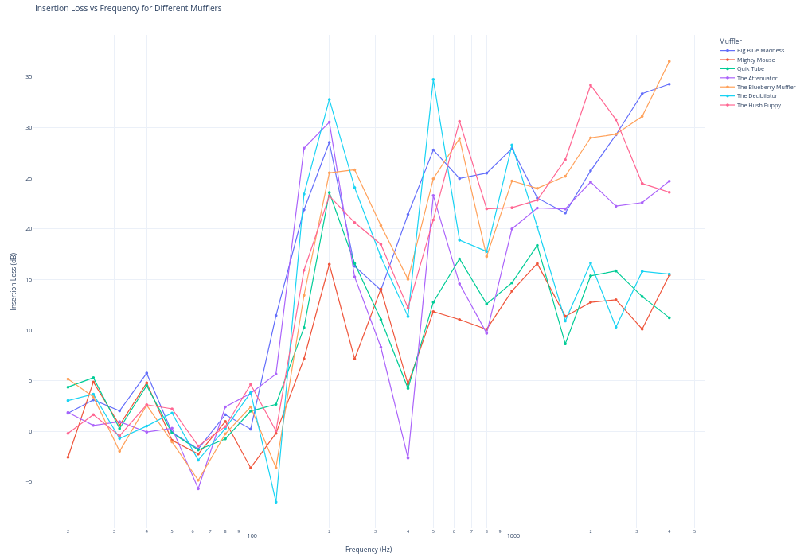
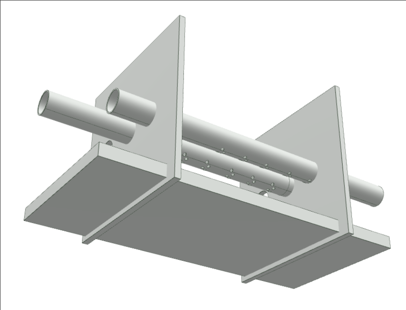
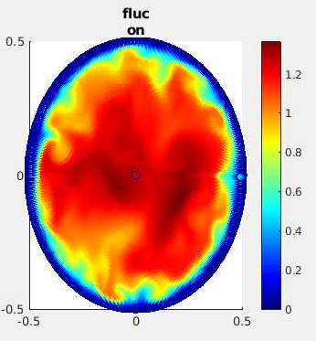

#+TITLE: Michael Raba Portfolio Fall 25 
#+AUTHOR: Michael Raba, MSc Candidate University of Kentucky '25 
#+LATEX_CLASS: beamer

 #+latex_header: \setlength{\paperwidth}{17in}
 #+latex_header: \setlength{\textwidth}{15in}
 #+latex_header: \setlength{\paperheight}{11in}
 #+latex_header: \setlength{\textwidth}{9in}

# #+latex_header: \setlength{\paperwidth}{11in}
# #+latex_header: \setlength{\textwidth}{9in}
# #+latex_header: \setlength{\paperheight}{8.5in}
# #+latex_header: \setlength{\textwidth}{7in}

# #+LATEX_CLASS_OPTIONS: [aspectratio=169,professionalfonts,11pt]
# #+LATEX_HEADER: \usepackage[paperwidth=17in, paperheight=11in, margin=0.5in, landscape]{geometry}

#+LATEX_CLASS_OPTIONS: [professionalfonts,11pt]

#+LATEX_COMPILER: xelatex
# --- Theme & Layout ---
#+LATEX_HEADER: \usetheme{metropolis}
#+LATEX_HEADER: \usecolortheme{default}
#+LATEX_HEADER: \metroset{
#+LATEX_HEADER:   block=fill,
#+LATEX_HEADER:   numbering=fraction,
#+LATEX_HEADER:   progressbar=foot,
#+LATEX_HEADER:   titleformat=smallcaps,
#+LATEX_HEADER:   sectionpage=progressbar
#+LATEX_HEADER: }

# --- Fonts ---
#+LATEX_HEADER: \usepackage{fontspec}
#+LATEX_HEADER: \setmonofont{DejaVu Sans Mono}
# #+LATEX_HEADER: \setsansfont{Avenir LT Std}
# #+LATEX_HEADER: \setmainfont{Avenir LT Std}

# --- General Formatting ---
#+LATEX_HEADER: \usepackage{setspace}
#+LATEX_HEADER: \onehalfspacing
#+LATEX_HEADER: \usepackage{booktabs}
#+LATEX_HEADER: \usepackage[table]{xcolor}
#+LATEX_HEADER: \usepackage{colortbl}
#+LATEX_HEADER: \usepackage{sectsty}
#+LATEX_HEADER: \usepackage{soul}
#+LATEX_HEADER: \usepackage{microtype}
#+LATEX_HEADER: \usepackage{siunitx}
#+LATEX_HEADER: \usepackage{physics}
#+LATEX_HEADER: \usepackage[tikz]{bclogo}
#+LATEX_HEADER: \setcounter{MaxMatrixCols}{20}

# --- Bibliography ---
#+LATEX_HEADER: \usepackage[style=authoryear-icomp,bibstyle=authoryear,hyperref=true,backref=true,maxcitenames=3,url=true,backend=biber,natbib=true]{biblatex}
#+LATEX_HEADER: \bibliography{bib.bib}

# --- Code Highlighting ---
#+LATEX_HEADER: \usepackage{minted,xcolor}
#+LATEX_HEADER: \usemintedstyle{manni}
#+LATEX_HEADER: \definecolor{bg}{HTML}{ffffe6}
#+LATEX_HEADER: \setminted{bgcolor=bg,linenos}

# --- Custom Colors ---
#+LATEX_HEADER: \definecolor{TyrianPurple}{HTML}{66023C}
#+LATEX_HEADER: \definecolor{Tiffany}{HTML}{00FFDD}

# --- Beamer Color Overrides ---
#+LATEX_HEADER: \setbeamercolor{alerted text}{fg=orange}
#+LATEX_HEADER: \setbeamercolor{frametitle}{bg=TyrianPurple,fg=white}
#+LATEX_HEADER: \setbeamercolor{section in toc}{fg=TyrianPurple}
#+LATEX_HEADER: \setbeamercolor{progress bar in head/foot}{fg=TyrianPurple,bg=gray!30}

# --- Optional: frametitle styling ---
#+LATEX_HEADER: \setbeamerfont{frametitle}{series=\bfseries,size=\large}
#+LATEX_HEADER: \setbeamertemplate{frametitle}{
#+LATEX_HEADER:   \vspace*{0.5em}
#+LATEX_HEADER:   \nointerlineskip
#+LATEX_HEADER:   \begin{beamercolorbox}[wd=\paperwidth,ht=2.5ex,dp=1.0ex,leftskip=1em]{frametitle}
#+LATEX_HEADER:     \usebeamerfont{frametitle}\insertframetitle
#+LATEX_HEADER:   \end{beamercolorbox}
#+LATEX_HEADER: }

# --- TikZ ---
#+LATEX_HEADER: \usepackage{tikz}

#+OPTIONS: toc:nil num:nil

* Multichamber Muffler
:PROPERTIES:
:BEAMER_env: frame
:END:

** Left Column
:PROPERTIES:
:BEAMER_col: 0.88
:END:

\textbf{Insertion Loss for Multichamber vs Competing Mufflers}
- Goal: maximize Insertion Loss
  - Insertion loss is the reduction in signal power (e.g., sound or RF) caused by inserting a device into a system, whereas transmission loss measures the total reduction in signal as it passes through a medium or barrier, independent of any added device.
  - IL isolates the muffler’s effect, letting evaluate designs without being affected by other parts of the exhaust/environment

#+ATTR_LATEX: :width 0.7\textwidth
#+caption: Insertion Loss for Muffler Competition

#+caption: Sidlab 1d Insertion Loss Approximation (Transfer Matrix system)
#+ATTR_LATEX: :width 0.7\textwidth
[[../510finalProj/imag/bbm.png]]

\begin{align}
\text{IL}_\text{Big Blue Madness}(f) &= L_\text{straight}(f) - L_\text{Big Blue Madness}(f)
\end{align}     

** Right Column
:PROPERTIES:
:BEAMER_col: 0.88
:END:

#+caption: Multicomponent Muffler Internal Geometry (Ansys Workbench/Acoustics Module)
#+ATTR_LATEX: :width 0.7\textwidth

#+ATTR_LATEX: :width 0.7\textwidth
#+caption: Sidlab 1d approximation (Transfer Matrix system)
[[../510finalProj/imag/sid1.png]]

*  Anand Model: Viscoelastoplasticity and its Application to Solder Joints
** Left Column
:PROPERTIES:
:BEAMER_col: 0.88
:END:
#+caption: Anand Viscoplasticity model applied to electronics packaging (pcb). 
[[../603talk/chip.png]]

*** Models Viscoplastic (Metals under Temperature/thermal cycling)
- \textbf{Broad Application:} *Model metals under thermal cycling! Temperature and Strain dependance!*
- Applies Anand’s unified viscoplastic framework to model solder behavior
- Anand's model can be reduced and fitted from experiments
- transition the theory into engineering-scale implementation
- Targets solder joints in microelectronic packages (chip on PCB, soldered connections)

*** Viscoplastic System of Equations (Anand)
\begin{align}
\text{Flow Rule (Plastic Strain Rate):} \quad
\dot{\varepsilon}^p &= A \exp\left( -\frac{Q}{R T} \right)
\left[ \sinh\left( \frac{j \, \sigma}{s} \right) \right]^{1/m}, \\
&\text{Plastic strain rate increases with stress and temperature,} \notag \\
&\text{No explicit yield surface; flow occurs at all nonzero stresses.} \notag
\end{align}

\begin{align}
\text{Deformation Resistance Saturation } s^*: \quad
s^* &= \hat{s} \left( \frac{\dot{\varepsilon}^p}{A} \exp\left( \frac{Q}{R T} \right) \right)^n, \\
&\text{Defines the steady-state value that } s \text{ evolves toward,} \notag \\
&\text{Depends on strain rate and temperature.} \notag
\end{align}

\begin{align}
\text{Evolution of Deformation Resistance } s: \quad
\dot{s} &= h_0 \left| 1 - \frac{s}{s^*} \right|^a
\, \text{sign}\left(1 - \frac{s}{s^*}\right) \dot{\varepsilon}^p, \\
&\text{Describes dynamic hardening and softening of the material,} \notag \\
& s \text{ evolves depending on proximity to } s^* \text{ and flow activity.} \notag
\end{align}

\noindent
\textit{Note: Constants $A, Q, m, j, h_0, \hat{s}, n, a$ are material-specific and fitted to experimental creep/strain rate data.}

** Right Column
:PROPERTIES:
:BEAMER_col: 0.88
:END:

#+caption:  strain-rate and temperature dependence of solder materials (Source: Wang 2001 Paper)
[[../603talk/wMPa.png]]

#+caption: Running model using Forward Euler code
[[../603talk/stress_vs_strain_62Sn36Pb2Ag.png]]

* Turbulence Suppression (SVD-FFT Method)

** Left Column
:PROPERTIES:
:BEAMER_col: 0.88
:END:

#+caption: Decompose turbulent pipe flow (Reynolds number $Re=5300$ and $Re=11,700$) to Modal FFT/POD decomposition 
#+ATTR_LATEX: :width 0.5\textwidth
[[../MScUpdated/images/baileyedit/screenshot2023-04-15_10-45-50_.png]]

#+ATTR_LATEX: :width 0.5\textwidth
[[../MScUpdated/images/baileyedit/screenshot2023-04-15_10-47-35_.png]]

- Idea: Reduce turbulent flow to FFt-POD so it can be easily studied. The lowest POD modes have the most energy $\therefore$ most important
- Relaminarization occurs by suppression of near-wall vortices and streak breakdown.
- Applications: rotating heat exchangers, turbomachinery, compact fluid systems.
  
** Right Column
:PROPERTIES:
:BEAMER_col: 0.88
:END:
 
#+ATTR_LATEX: :width 0.5\textwidth
#+caption: Fluid field in streamwise direction $\textbf{u}_w$

#+ATTR_LATEX: :width 0.5\textwidth
#+caption: Turbulent Flow 
[[../origPODtalks/images/reveal/screenshot2023-01-05_13-26-09_.png]]

#+ATTR_LATEX: :width 0.5\textwidth
#+caption: Relaminarized flow (Broadband Energy Distribution)
[[../origPODtalks/images/baileyedit/screenshot2023-04-15_10-48-49_.png]]
