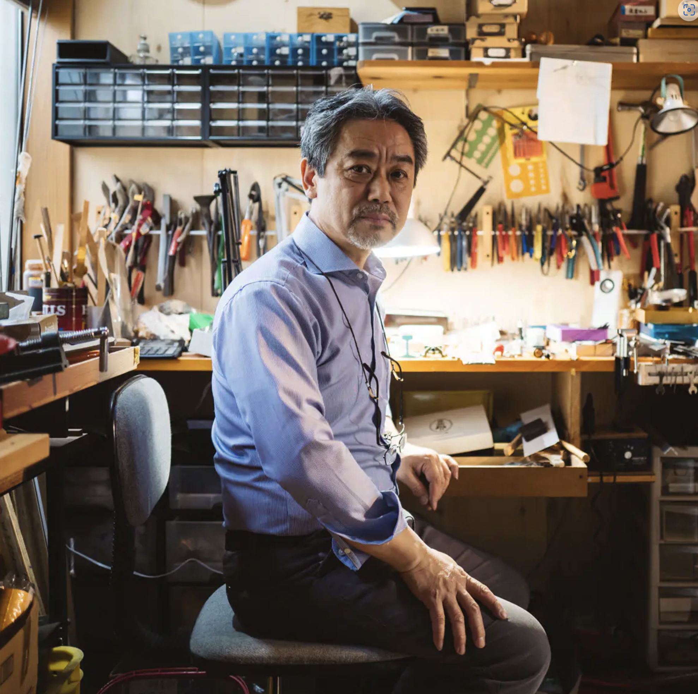
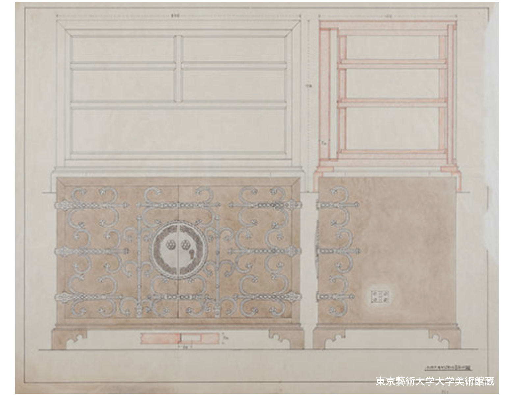
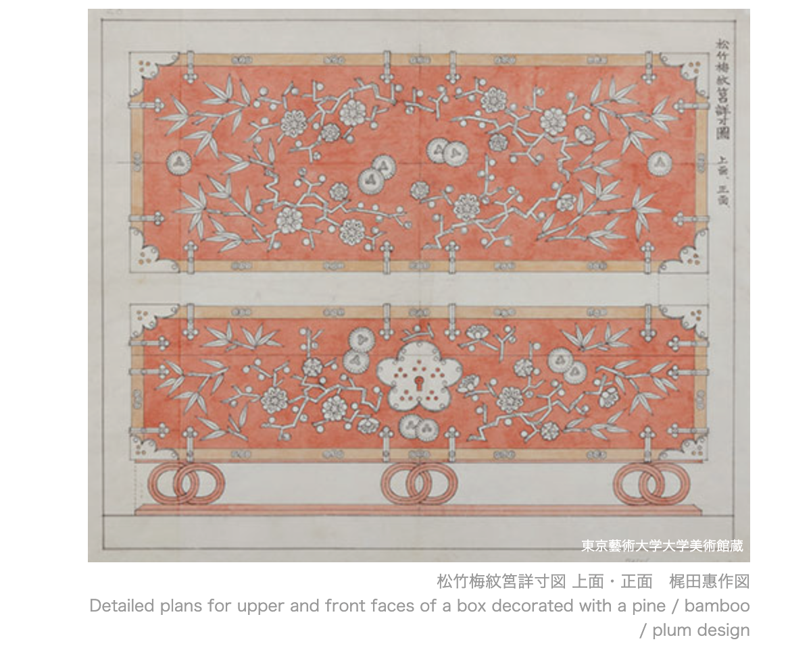
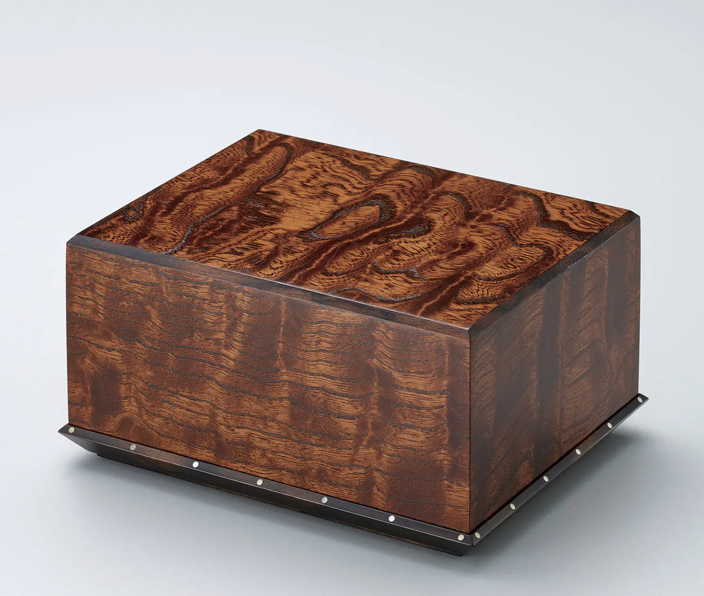

#+TITLE: Seiga [清雅] The Architecture of Refinement
#+SUBTITLE: The Work of Living National Treasure Kenji Suda [須田賢司]
#+AUTHOR: Presented by: Michael Raba for AS 390
#+OPTIONS: num:nil toc:nil
#+OPTIONS: toc:nil num:nil creator:nil timestamp:nil

# --- Reveal.js Configuration ---
#+REVEAL_ROOT: https://cdn.jsdelivr.net/npm/reveal.js@4.6.0/
#+REVEAL_THEME: serif
#+REVEAL_TRANS: fade
#+REVEAL_INIT_OPTIONS: controls:true, progress:true, slideNumber:true, transition:'fade'
#+REVEAL_EXTRA_CSS: style.css

* Kenji Suda: The Living National Treasure (Japan)
  :PROPERTIES:
  :CUSTOM_ID: introduction
  :END:

#+BEGIN_EXPORT html
<li style="margin-bottom: 12px;"><strong>Born:</strong> June 27, 1954 | Tokyo, Japan</li>
<li style="margin-bottom: 12px;"><strong>Conceptual Practice:</strong> Suda bridges the gap between functional craft and high art, emphasizing the dialogue between the natural life of the timber and the geometric precision of <em>Sashimono</em>. His practice is rooted in the "spirit of the material," where the maker's ego is secondary to the inherent beauty of the wood grain.</li>
<li style="margin-bottom: 12px;"><strong>Heritage:</strong> A <em>Ningen Kokuho</em> (Living National Treasure) representing the fourth generation of the Suda woodworking lineage.</li>

  

    
  

  

    <ul style="list-style-type: none; padding-left: 0;">
      <li style="margin-bottom: 12px;"><strong>Heritage:</strong> A <em>Ningen Kokuho</em> (Living National Treasure) representing the third generation of the Suda woodworking lineage.</li>
      <li style="margin-bottom: 12px;"><strong>The Seiga [清雅] Spirit:</strong> His work is defined by "Refined Purity," evolving 2,000 years of <em>Monozukuri</em> history into modern wood art.</li>
      <li style="margin-bottom: 12px;"><strong>Shift in Role:</strong> His career tracks the transition from the <em>Sashimono-shi</em> (technical joiner) to the <em>Mokko-geika</em> (woodworking artist).</li>
    </ul>
  

#+END_EXPORT

** Kenji in workshop

* Style/Technique

- use of local kiln dried woods (mulberry)
- unites: blacksmithing, joinery, and lacquer (fuku-urshi)

#+begin_export html

  

    <h3 style="color: #666;">blind (hidden) joinery</h3>
    
  

  

    <h3 style="color: #666;">lacquered detail closeup</h3>
    
  

#+end_export

* Grandfather's Plane

[[./images/plane.png]]

** Detail

The small planes in the hand of Kenji
Suda were used by his grandfather Sogetsu, and the blades are said to be the
works of famous bladesmith Nobuyoshi. Kenji wrote that, “There is nothing more
to say except that they cut well.” The well-used tools have a particular
beauty.

* Grandfather's Box
Mulberry writing box
Creator: Suda Sogetsu (1877-1950)

#+ATTR_HTML: :style max-height: 50vh; width: auto; object-fit: contain;
[[./images/grandfatherMulberry.png]]

** Detail

credited with elevating the family's technical standards to the elite levels required for Imperial-grade furnishings.

- *Imperial Household Agency* : functional, ultra-high-end furnishings meant for the environments where the Imperial family lived or held audiences.
* Father's Box
Suda Kuwasui "Black Persimmon Chest of Drawers" 1979

#+ATTR_HTML: :style max-height: 50vh; width: auto; object-fit: contain;
[[./images/fatherBox.png]]
** Detail

- clean lines, structural balance, and the functional beauty of the Sashimono joints.

- National Art Exhibitions

* Father's Box 2

#+ATTR_HTML: :style max-height: 50vh; width: auto; object-fit: contain;
[[./images/fatherBox2.png]]

* Historical First

#+ATTR_HTML: :style max-height: 50vh; width: auto; object-fit: contain;
[[./images/hist1.png]]

** Detail

#+ATTR_HTML: :style max-height: 50vh; width: auto; object-fit: contain;

** Detail

#+ATTR_HTML: :style max-height: 50vh; width: auto; object-fit: contain;

* Suiko Box

#+ATTR_HTML: :style max-height: 50vh; width: auto; object-fit: contain;
[[./images/suiko.png]]

* Tsukuhae Box
Hirin gen'ei 碑林玄英 (Stela Forest in Winter)
2013

#+ATTR_HTML: :style max-height: 50vh; width: auto; object-fit: contain;
[[./images/tsu.png]]

** Tsukuhae Box

[[./images/tsu2.png]]

* Contrast

Suiko captures the fluid, rhythmic energy of daylight reflecting off rippling water,

whereas Tsukuhae emphasizes the quiet, singular stillness of moonlight in the dark.

Visually, this creates a tension between the Suiko's edge-to-edge movement and the Tsukuhae's minimalist, atmospheric focus.

* Joinery (Deconstructed)

#+ATTR_HTML: :style max-height: 50vh; width: auto; object-fit: contain;
[[./images/joinery1.png]]

* Small Box of Zelkova Finished in Wiped Urushi (2022).

#+ATTR_HTML: :style max-height: 50vh; width: auto; object-fit: contain;

** Analysis

- Zelkova is famous for its bold, "mountains and rivers" grain. In this piece, Suda has selected a cut where the grain lines are broad and stable.

- He is letting the simple, natural growth rings of the Zelkova tree do the talking, rather than relying on a flashy, "busy" grain to impress the viewer.

* Ohotera: Table of Pear and Locust (2024)
  :PROPERTIES:
  :CUSTOM_ID: slide-t1-intro
  :END:

#+BEGIN_EXPORT html

  

    
  

  

    <ul style="list-style-type: none; padding-left: 0;">
      <li style="margin-bottom: 10px;"><strong>Artist:</strong> Kenji Suda [須田賢司]</li>
      <li style="margin-bottom: 10px;"><strong>Status:</strong> Living National Treasure</li>
      <li style="margin-bottom: 10px;"><strong>Typology:</strong> Functional Furniture / Wood Art</li>
      <li style="margin-bottom: 10px;"><strong>Dimensions:</strong> H 32.0 × W 114.0 × D 46.0 cm</li>
      <li style="margin-bottom: 10px;"><strong>Value:</strong> ¥1M - 6M ($6.5k - $40k USD)</li>
    </ul>
  

#+END_EXPORT

** Concept, Structure & Materiality
  :PROPERTIES:
  :CUSTOM_ID: slide-t1-technical
  :END:

- **Concept:** Organizing rectilinear planes with a "Seiga" (refined purity) motif. The formal elements emphasize horizontal massing, where the "S-curve" of the leg-to-apron transition creates a fluid line from the ground to the surface.
- **Structure:** A **codependent** structural system. The table utilizes traditional *Sashimono* (blind joinery) to handle the tension of the cantilevered top. The relationship between the low height (32cm) and the wide span (114cm) requires high-precision compression joints to prevent racking without metal hardware.
- **Materials:** Deploys **Kenponashi** (Japanese Raisin Tree/Pear) for its refined grain and **Enju** (Japanese Pagoda/Locust) for structural density. These choices balance the aesthetic need for "shimmer" with the functional requirement of a load-bearing surface.

** Process, Details & Context
  :PROPERTIES:
  :CUSTOM_ID: slide-t1-context
  :END:

#+BEGIN_EXPORT html

  

    <ul style="list-style-type: none; padding-left: 0;">
      <li style="margin-bottom: 12px;"><strong>Process:</strong> Fabricated using 2,000-year-old assembly methods, planed by hand to achieve a "wiped" finish that highlights the grain. The process itself is the aesthetic; every joint interface is a visible testament to mastery.</li>
     <li style="margin-bottom: 12px;"><strong>Context:</strong> Designed for high-end residential or traditional <em>Washitsu</em> (Japanese room) environments. Targets elite collectors/museums, justified by Suda's status and the "complete" technical mastery required for glue-less joinery.</li>
    </ul>
  

  

    
  

#+END_EXPORT

* Sycamore Maple Box (2019)
  :PROPERTIES:
  :CUSTOM_ID: slide-1
  :END:

#+ATTR_HTML: :style max-height: 50vh; width: auto; object-fit: contain;
  [[./images/d1.png]]

  - *Artisan:* Carpenter (Sashimono Specialist)
  - *Material:* Curly Maple (Sycamore)
  - *Exhibition:* 66th Japan Traditional Crafts (2019)

** Concept, Structure & Materiality
  :PROPERTIES:
  :CUSTOM_ID: slide-2
  :END:

  - *Concept:* Formal organization of rectilinear planes and rhythmic repetition; grain "chatoyancy" contrasts with dark vertical massing.
  - *Structure:* Codependent *Sashimono* (blind joinery) system; relies on precision-fit compression and mechanical locking without fasteners.
  - *Materials:* Curly Maple selected for aesthetic shimmer and high structural density; technology of the hand expressed through grain-matching.

** Process, Details & Context
  :PROPERTIES:
  :CUSTOM_ID: slide-3
  :END:

  - *Process:* Sequential interlocking of *tsugite* joints; fabrication is elevated to an aesthetic by exposing joinery as a serrated decorative element.
  - *Details:* Large maple chassis; Medium rhythmic joinery "teeth"; Small metal pins and circular surface inlays.
  - *Context:* Functional sculpture for institutional/collector environments; labor-intensive fabrication justifies high-end retail price point.

* Yatsuhashi II: Claro Walnut and Cherry Wood Table
  :PROPERTIES:
  :CUSTOM_ID: slide-1
  :END:

#+ATTR_HTML: :style max-height: 50vh; width: auto; object-fit: contain;
  [[./images/d2.png]]

  - *Artisan:* Kenji Suda (Living National Treasure)
  - *Material:* Claro Walnut and Cherry Wood
  - *Dimensions:* H 72.0 x W 160.0 x D 135.0 cm

** Concept, Structure & Materiality
   :PROPERTIES:
   :CUSTOM_ID: slide-2
   :END:

#+BEGIN_EXPORT html

  

    
  

  

    <ul style="list-style-type: none; padding-left: 0;">
      <li style="margin-bottom: 15px;"><strong>Concept:</strong> Formal organization of rectilinear planes and rhythmic repetition; grain "chatoyancy" contrasts with dark vertical massing.</li>
      <li style="margin-bottom: 15px;"><strong>Structure:</strong> Codependent <em>Sashimono</em> (blind joinery) system; relies on precision-fit compression and mechanical locking without fasteners.</li>
      <li style="margin-bottom: 15px;"><strong>Materials:</strong> Curly Maple selected for aesthetic shimmer and high structural density; technology of the hand expressed through grain-matching.</li>
    </ul>
  

#+END_EXPORT

** Process, Details & Context
  :PROPERTIES:
  :CUSTOM_ID: slide-3
  :END:

  - *Process:* Fabricated using high-precision *Sashimono* (wood joinery) and finished in wiped lacquer (*urushi*) to accentuate the grain without masking the tactile surface.
  - *Details:* Large interlocking walnut planks; Medium cherry structural beams; Small precisely carved joint interfaces where the "planks" meet the frame.
  - *Context:* A monumental functional sculpture intended for institutional or high-end residential interiors; its status as a work by a Living National Treasure places it in a high-luxury price bracket for serious collectors.

* Philosophy: Craft as Life [生活 - Seikatsu]
  :PROPERTIES:
  :CUSTOM_ID: philosophy
  :END:

#+BEGIN_EXPORT html

  

    <ul style="list-style-type: none; padding-left: 0;">
      <li style="margin-bottom: 12px;"><strong>Beyond Work:</strong> For Suda, being in the workshop is not "labor" but simply <em>living</em>. The act of creation is inseparable from existence.</li>
      <li style="margin-bottom: 12px;"><strong>Mederu [愛でる]:</strong> The philosophy of "loving and cherishing" ordinary objects. He believes beauty must be rooted in the home and daily use, not just the gallery.</li>
      <li style="margin-bottom: 12px;"><strong>Nature’s Revelation:</strong> As seen in his <em>Suiko</em> and <em>Tsukuhae</em> boxes, he planed a blackened, discarded log to reveal grain patterns like "moonlight on dark water."</li>
    </ul>
  

  

    
  

#+END_EXPORT
