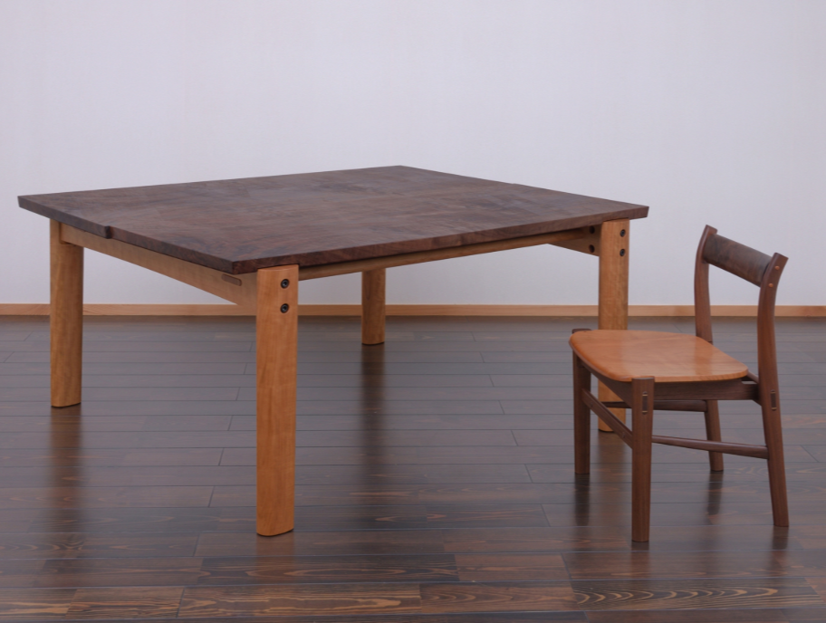

#+TITLE: Seiga [清雅] The Architecture of Refinement
#+SUBTITLE: The Work of Living National Treasure Kenji Suda [須田賢司]
#+AUTHOR: Presented by: Michael Raba for AS 390
#+OPTIONS: num:nil toc:nil
#+OPTIONS: toc:nil num:nil creator:nil timestamp:nil

# --- Reveal.js Configuration ---
#+REVEAL_ROOT: https://cdn.jsdelivr.net/npm/reveal.js@4.6.0/
#+REVEAL_THEME: serif
#+REVEAL_TRANS: fade
#+REVEAL_INIT_OPTIONS: controls:true, progress:true, slideNumber:true, transition:'fade'
#+REVEAL_EXTRA_CSS: style.css

* Kenji Suda: The Living National Treasure (Japan)
  :PROPERTIES:
  :CUSTOM_ID: introduction
  :END:

#+BEGIN_EXPORT html

  

    
  

  

    <ul style="list-style-type: none; padding-left: 0;">
      <li style="margin-bottom: 12px;"><strong>Heritage:</strong> A <em>Ningen Kokuho</em> (Living National Treasure) representing the third generation of the Suda woodworking lineage.</li>
      <li style="margin-bottom: 12px;"><strong>The Seiga [清雅] Spirit:</strong> His work is defined by "Refined Purity," evolving 2,000 years of <em>Monozukuri</em> history into modern wood art.</li>
      <li style="margin-bottom: 12px;"><strong>Shift in Role:</strong> His career tracks the transition from the <em>Sashimono-shi</em> (technical joiner) to the <em>Mokko-geika</em> (woodworking artist).</li>
    </ul>
  

#+END_EXPORT

* Materials & The Continuity of Craft
  :PROPERTIES:
  :CUSTOM_ID: materials-history
  :END:

- **The Power of Mulberry [桑]:** Suda utilizes Mikura Island Mulberry—the legendary material of *Edo Sashimono*, often combining it with Sycamore to bridge ancestral techniques with modern aesthetics.
- **A 2,000-Year Timeline:** Suda views joinery as a "complete" technology since the 1st century; he works to keep this ancient lineage breathing in the present day.
- **Ebijo [蝦錠]:** A rare artist-blacksmith, Suda hand-forges his own "shrimp-shaped" locks based on 6th-century Asuka Period designs to give his wood "historical gravity."

* Philosophy: Craft as Life [生活 - Seikatsu]
  :PROPERTIES:
  :CUSTOM_ID: philosophy
  :END:

#+BEGIN_EXPORT html

  

    <ul style="list-style-type: none; padding-left: 0;">
      <li style="margin-bottom: 12px;"><strong>Beyond Work:</strong> For Suda, being in the workshop is not "labor" but simply <em>living</em>. The act of creation is inseparable from existence.</li>
      <li style="margin-bottom: 12px;"><strong>Mederu [愛でる]:</strong> The philosophy of "loving and cherishing" ordinary objects. He believes beauty must be rooted in the home and daily use, not just the gallery.</li>
      <li style="margin-bottom: 12px;"><strong>Nature’s Revelation:</strong> As seen in his <em>Suiko</em> and <em>Tsukuhae</em> boxes, he planed a blackened, discarded log to reveal grain patterns like "moonlight on dark water."</li>
    </ul>
  

  

    
  

#+END_EXPORT

* Ohotera: Table of Pear and Locust (2024)
  :PROPERTIES:
  :CUSTOM_ID: slide-t1-intro
  :END:

#+BEGIN_EXPORT html

  

    
  

  

    <ul style="list-style-type: none; padding-left: 0;">
      <li style="margin-bottom: 10px;"><strong>Artist:</strong> Kenji Suda [須田賢司]</li>
      <li style="margin-bottom: 10px;"><strong>Status:</strong> Living National Treasure</li>
      <li style="margin-bottom: 10px;"><strong>Typology:</strong> Functional Furniture / Wood Art</li>
      <li style="margin-bottom: 10px;"><strong>Dimensions:</strong> H 32.0 × W 114.0 × D 46.0 cm</li>
      <li style="margin-bottom: 10px;"><strong>Value:</strong> ¥1M - 6M ($6.5k - $40k USD)</li>
    </ul>
  

#+END_EXPORT

** Concept, Structure & Materiality
  :PROPERTIES:
  :CUSTOM_ID: slide-t1-technical
  :END:

- **Concept:** Organizing rectilinear planes with a "Seiga" (refined purity) motif. The formal elements emphasize horizontal massing, where the "S-curve" of the leg-to-apron transition creates a fluid line from the ground to the surface.
- **Structure:** A **codependent** structural system. The table utilizes traditional *Sashimono* (blind joinery) to handle the tension of the cantilevered top. The relationship between the low height (32cm) and the wide span (114cm) requires high-precision compression joints to prevent racking without metal hardware.
- **Materials:** Deploys **Kenponashi** (Japanese Raisin Tree/Pear) for its refined grain and **Enju** (Japanese Pagoda/Locust) for structural density. These choices balance the aesthetic need for "shimmer" with the functional requirement of a load-bearing surface.

** Process, Details & Context
  :PROPERTIES:
  :CUSTOM_ID: slide-t1-context
  :END:

#+BEGIN_EXPORT html

  

    <ul style="list-style-type: none; padding-left: 0;">
      <li style="margin-bottom: 12px;"><strong>Process:</strong> Fabricated using 2,000-year-old assembly methods, planed by hand to achieve a "wiped" finish that highlights the grain. The process itself is the aesthetic; every joint interface is a visible testament to mastery.</li>
     <li style="margin-bottom: 12px;"><strong>Context:</strong> Designed for high-end residential or traditional <em>Washitsu</em> (Japanese room) environments. Targets elite collectors/museums, justified by Suda's status and the "complete" technical mastery required for glue-less joinery.</li>
    </ul>
  

  

    
  

#+END_EXPORT

* D1: Sycamore Maple Box (2019)
  :PROPERTIES:
  :CUSTOM_ID: slide-1
  :END:

  [[./images/d1.png]]

  - *Artisan:* Carpenter (Sashimono Specialist)
  - *Material:* Curly Maple (Sycamore)
  - *Exhibition:* 66th Japan Traditional Crafts (2019)

** Concept, Structure & Materiality
  :PROPERTIES:
  :CUSTOM_ID: slide-2
  :END:

  - *Concept:* Formal organization of rectilinear planes and rhythmic repetition; grain "chatoyancy" contrasts with dark vertical massing.
  - *Structure:* Codependent *Sashimono* (blind joinery) system; relies on precision-fit compression and mechanical locking without fasteners.
  - *Materials:* Curly Maple selected for aesthetic shimmer and high structural density; technology of the hand expressed through grain-matching.

** Process, Details & Context
  :PROPERTIES:
  :CUSTOM_ID: slide-3
  :END:

  - *Process:* Sequential interlocking of *tsugite* joints; fabrication is elevated to an aesthetic by exposing joinery as a serrated decorative element.
  - *Details:* Large maple chassis; Medium rhythmic joinery "teeth"; Small metal pins and circular surface inlays.
  - *Context:* Functional sculpture for institutional/collector environments; labor-intensive fabrication justifies high-end retail price point.

* Yatsuhashi II: Claro Walnut and Cherry Wood Table
  :PROPERTIES:
  :CUSTOM_ID: slide-1
  :END:

  

  - *Artisan:* Kenji Suda (Living National Treasure)
  - *Material:* Claro Walnut and Cherry Wood
  - *Dimensions:* H 72.0 x W 160.0 x D 135.0 cm

** Concept, Structure & Materiality
   :PROPERTIES:
   :CUSTOM_ID: slide-2
   :END:

#+BEGIN_EXPORT html

  

    
  

  

    <ul style="list-style-type: none; padding-left: 0;">
      <li style="margin-bottom: 15px;"><strong>Concept:</strong> Formal organization of rectilinear planes and rhythmic repetition; grain "chatoyancy" contrasts with dark vertical massing.</li>
      <li style="margin-bottom: 15px;"><strong>Structure:</strong> Codependent <em>Sashimono</em> (blind joinery) system; relies on precision-fit compression and mechanical locking without fasteners.</li>
      <li style="margin-bottom: 15px;"><strong>Materials:</strong> Curly Maple selected for aesthetic shimmer and high structural density; technology of the hand expressed through grain-matching.</li>
    </ul>
  

#+END_EXPORT

** Process, Details & Context
  :PROPERTIES:
  :CUSTOM_ID: slide-3
  :END:

  - *Process:* Fabricated using high-precision *Sashimono* (wood joinery) and finished in wiped lacquer (*urushi*) to accentuate the grain without masking the tactile surface.
  - *Details:* Large interlocking walnut planks; Medium cherry structural beams; Small precisely carved joint interfaces where the "planks" meet the frame.
  - *Context:* A monumental functional sculpture intended for institutional or high-end residential interiors; its status as a work by a Living National Treasure places it in a high-luxury price bracket for serious collectors.

